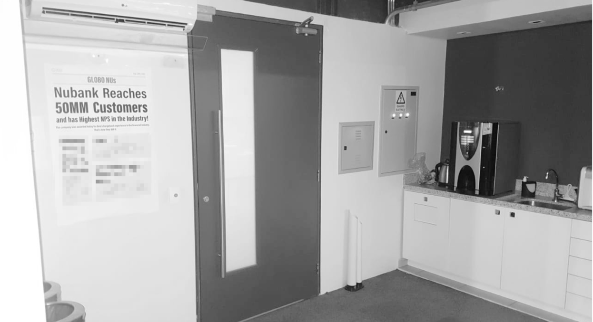

>#####**Disclaimer:** This is not exactly a case study of a specific project but rather a story of how we set the product vision for a customer support team at Nubank.

###Joining a team focused on operations
In early 2018 Nubank’s Chargeback[^1] experience (and team) needed some product love. The team focused on maintaining services and optimizing customer support processes. I had recently joined Nubank and was looking for problems to solve when I met Gustavo Mendes, a product manager that had also joined.

Gustavo gave me a brief overview of what he knew about chargebacks. It seemed complicated and full of ramifications/ edge-cases – which made me accept the challenge. During our first month working in chargeback, we spent several hours working as Xpeers (Nubank’s customer support heroes). We learned how to use back-office tools, got familiar with dispute processes, and understood the various backend services. 

 

###Gathering internal and external customer feedback
As there were no product folks in the team for a long time, the product backlog was very confusing and the team prioritised work was blurry. We needed a way to collect feedback from both customers and Xpeers (this second group was around the mark of 100 people at that time).

We put together a quick Google Forms →  Zapier → Trello integration that enabled us to regularly collect feedback. This tool – creatively named XpeerVoice – helped me ramp up and evaluate the scale of the biggest pains in our homemade internal tool and also the self-service chargeback flow in the app.

Feedback was added to a Trello board where we replied Xpeers, asked for more info before estimating impact and eventually moved cards from there to our team’s backlog.

###The need for a longer-term vision
While there would always exist ways to improve customer support processes, Chargeback urged a vision. Gustavo and I now were at Nubank for around 2 months and agreed on building a longer-term vision with the rest of the team. We had a couple of projects going on, but they felt too reactive. Building our own strategy was the way to do proactive work and assure the experience was still the best in the industry in the years to come.

I suggested making a team dynamics, involving our stakeholders. For this activity, I brought an incomplete front-page of a newspaper. The headline read as the nightmare of any Xpeer: Nubank's customer base growing from 2MM to 50MM people over the next 2 years — without growing the customer support team. The title, however, indicated we had been successful in this mission. The rest of the page was blank and the activities we played helped us frame the pillars towards success.

That wasn’t the first collaborative session we had as a team but it was very emblematic to both me and Gustavo as that was the first time we felt more people were participating and  co-creating the direction Chargeback would sail towards for the near future. It was very energetic to have software engineers, business architects, customer support and even our then Chief Operations Officer in the same room to think about the foundations that would make us win the scalability game.

###Spreading the word
By the end of the team dynamics, we had 3 pillars that led our product vision. I can’t reveal what they were, but they had to do with:
- Improving the self-service experience to report a transaction and;
- Increasing the ratio of customers per Xpeer.

The Chargeback team was probably the largest at Nubank back then, occupying half a floor in our office at Rua Capote Valente. The best way to spread the vision was to print copies of the front page and put them on the walls, so our 127 team members would be in contact with it every day.

###New opportunities arise
New project opportunities started popping. Xpeers were super attentive to things in their routines that could push us away from the front page — like if they could see it fading, Back to the Future style. More and more people sent us feedback on XpeerVoice and came to talk to me about things that were… suboptimal. A good example of that was this spreadsheet:

//Figure: GIF spreadsheet.

This spreadsheet was used to control rebuttals: chargebacks that were “denied” and we wouldn’t be able to reimburse our clients. It seemed obvious that it was one of the blockers for us to scale the operation. With a simple effort × impact matrix it was crystal clear: we had found our first big impact project to tackle.

Designing this tool took me close to 2 months with multiple iterations every week always followed by demos and usability tests with Xpeers. It was a complex product to design but one of the main benefits of building an internal tool was that I could move fast. Sitting next to my customers was optimal for shorter feedback cycles and boosted product iteration.

//Figure: Close-ups. Open sans → Graphik; Checkboxes;  

While I can’t show you the tool, here are some of my favourite details of the work I’ve done

When we got to a version that attended Xpeer needs, we ran a final session with a group of people that had never seen the tool before. They were asked to perform the most frequent and critical actions from their routine and show us how they would do it. People who never saw that interface knew how to use it. I was confident to move with my solution.

###Shipping less than minimum
While the version we had in our hands seemed good enough to ship — and part of the back-end work had already started in parallel to the design explorations — it would still take a couple more months to get there. Another benefit of building internal products is that teams feel more comfortable taking bigger risks. I’m a big supporter of keeping things scrappy, and that’s exactly what we did.

Gustavo and I agreed to roll out the new tool. It had around 15% of the features I planned and they would enable Xpeers to complete less than 40% of the jobs using it. This is a message from Pato, one of our Xpeers after his first day using the tool.

Pato pushed some extra 1h/1h30 on his first day using it. He was very polite trying to blame his lack of familiarity with the tool, but we were the ones to blame. We released something that was barely useful. Pato still needed to shift tabs multiple times and use the old spreadsheet for more than half of his tasks.

After the first release, Gustavo and I called Xpeers using the new tool to help us with prioritization. We organized the backlog based on Xpeer feedback and gave them visibility of the features coming on the following week. This followed until we received the following messages:

//Figure: Shiny design.

I can’t really disclose the final design of that tool here, but imagine a shiny design in the picture above. Little by little we got closer to that and there’s some of the 

###Impact
The new tool reduced task completion time from 3 minutes to 27 seconds. Not only did it help the Xpeer team from growing but also it helped shrink it. This meant some of the Xpeers from our team could now focus on other contact reasons. 

We saved Nubank a few million Brazilian reais per year and changed the internal perception about the team. Chargeback went from the underdog to a team software engineers asked to work on.

One the personal side, working with this team was one of my best moments at Nubank. After working in a couple of other projects there, Gustavo and I decided to pursue different opportunities in the company. I started leading design for Credit Card and he led the team building the customer support platform. Our partnership, however, was just beginning. After that we jump-started several personal projects and internal side-quests together.

###Learnings
Design is about investing in the user’s experience before and after things go wrong. Simplifying thelife and work of customer support as simple as possible goes a long way to make them focus on what they do best: build trust with customers and foster empathy with them during product prioritisation.
