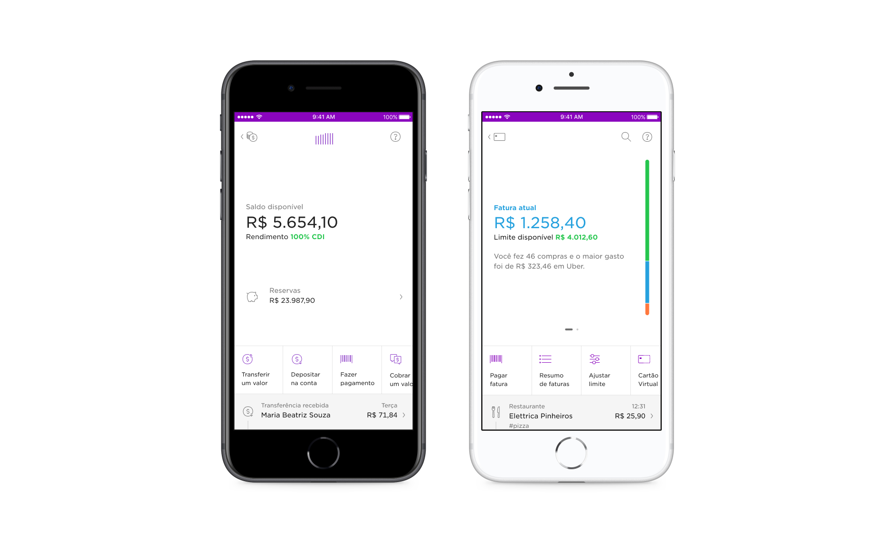
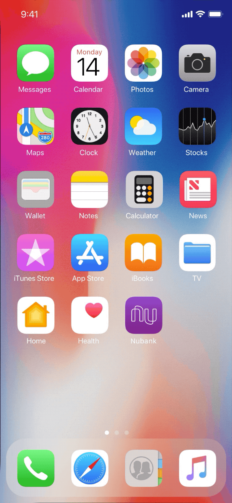
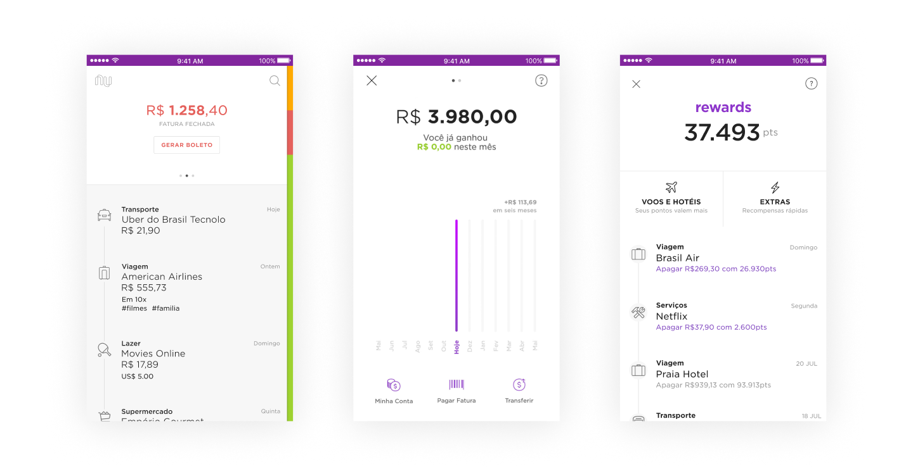
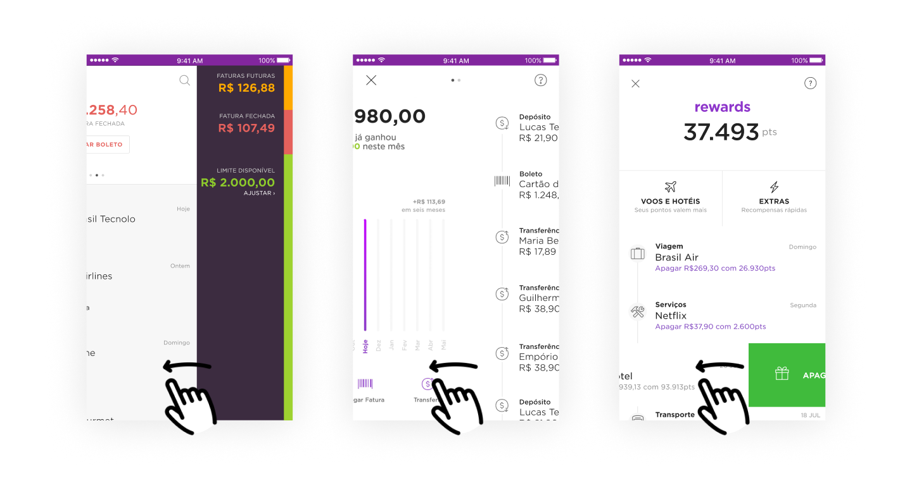
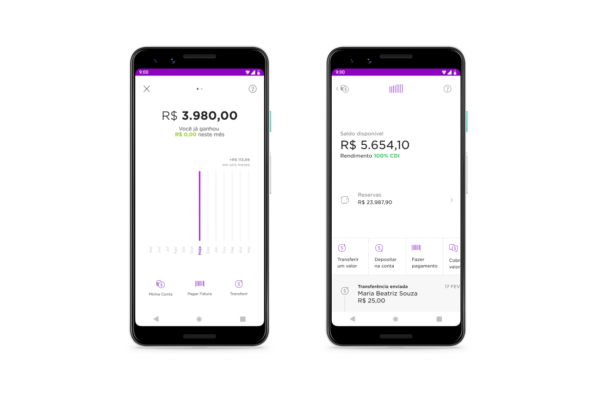
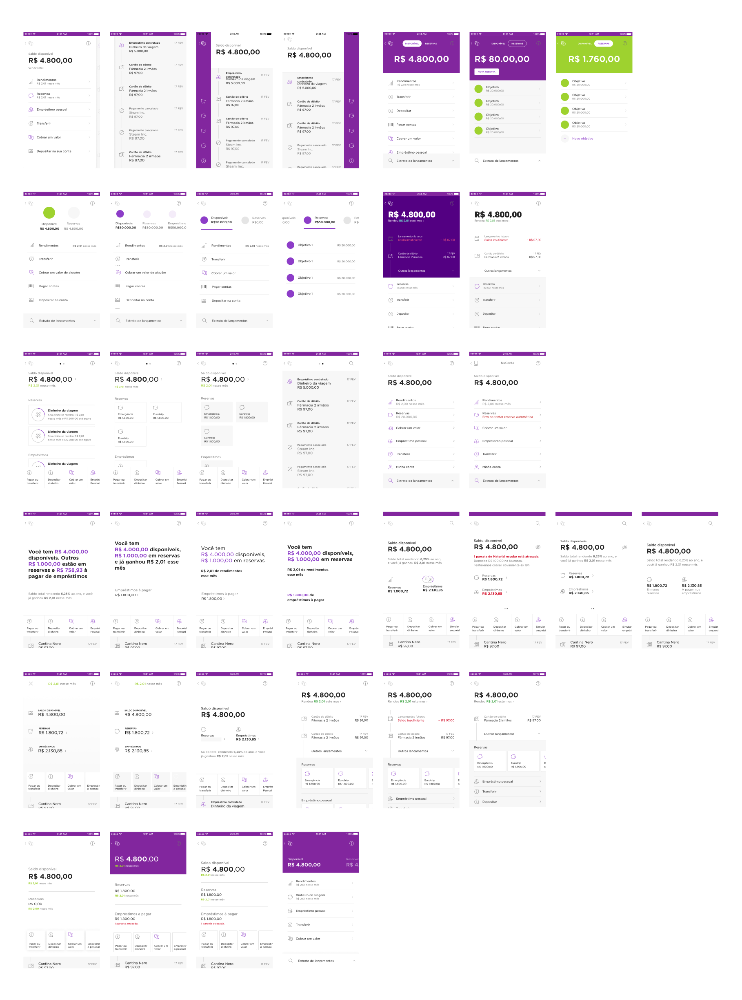
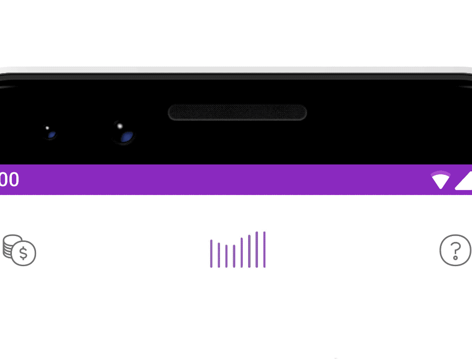
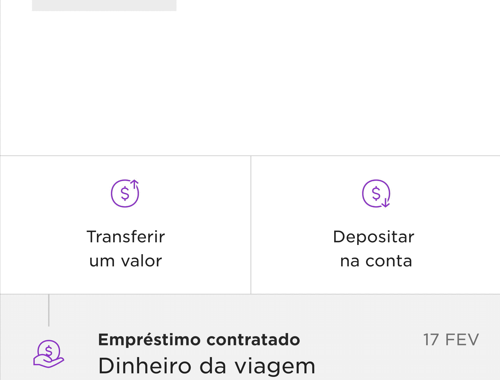
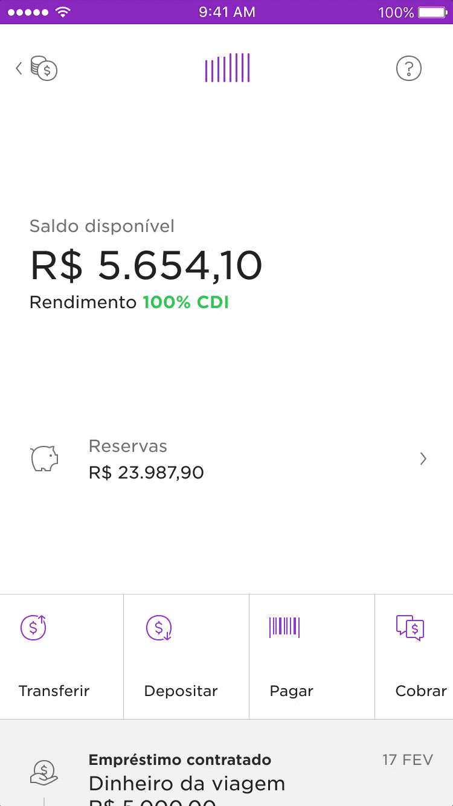
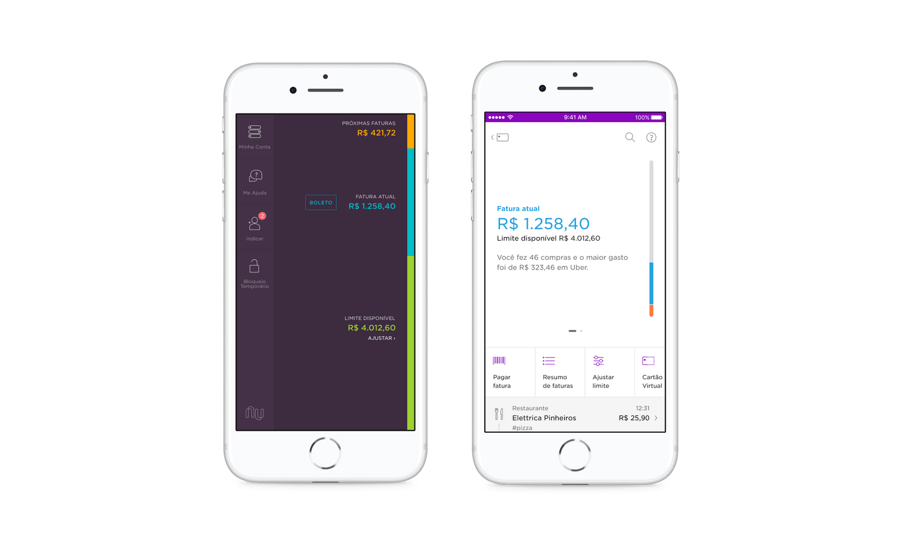

<!-- 

 -->

`video: ./images/cc-redesign.mp4`

##### Video by Everton Guilherme

### Overview
As Nubank shifted from a credit card to a more robust banking ecosystem, it became evident the need for a more cohesive interface for our products.

Different patterns accross the app hindered user onboarding, feature discovery and didn’t optimize for important product offerings. The current designs weren’t flexible enough to accomodate new features.

These two projects combined took the course of 3½ months where I redesigned and prototyped a new experience for our savings account and credit card dashboards.

### Impact

 
	

		<h3 style="margin-top:0"><strong>+11%</strong></h3>
		
people paying their credit card bill on time

	

	

		<h3 style="margin-top:0"><strong>+15%</strong></h3>
		
in revenue from instalment anticipation

	

 
	

		<h3 style="margin-top:0"><strong>+4%</strong></h3>
		
savings in customer support

	

	

		<h3 style="margin-top:0"><strong>2+ years</strong></h3>
		
shipping new features without refactoring the new interface

	

 
 

##### Long-format story below ↓

 

---

	</img>

<h5 style="margin-top: -24px">Nubank new home screen, May 2018</h5>

### Context: the Nubank app
In 2018, four years after Nubank was first launched to the public, we released the first redesign of our app's home screen. Six months before Nubank had been a credit card (only) company. 

Now, as we rolled out NuConta – a unique mix of savings and checking account – the app needed the space and structure for our family of products to continue to grow.

This design, led by Guilherme Neumann, was the shell for Nubank’s products and consisted of two main components.

1. **Widgets** — cards that worked as windows to the products (conta, credit and rewards). 
2. **Shortcuts** — buttons that helped navigate from one place to the other. They worked like doors to other parts of the app.  

Once you opened each of the widgets this is what you would see:

 
##### Product dashboards before the revamp.   While some of the structure was shared, you could see the fingerprints.

### The need for a new design framework
While the new home screen was succesful at giving more visibility of the savings account and rewards programme, it also highlighted the inconsistencies in the UI.

People had a steeper learning curve before making their first deposit and activating their credit card. We were distancing from Nubank’s “fight complexity, empower people” motto.

Here’s an example:

##### Swiping left in Credit Card, Nuconta and Rewards.  Different results and confused users.

As we onboarded several thousand — and later over a million — customers per month, our app urged a new product structure for both NuConta and the Credit Card.

 

---

 

####  Part I 
## Revamping the savings account – NuConta

Not long after rolling out our mix of checking/savings account I started working on the evolution of the original interface along with other two designers.

At that time, Mateus Peixoto and I were working on the yet-to-be-released personal loans product while Lucas Neumann was exploring ways to help customers separate money. After a few rounds of user interviews in our projects, it was clear: *our features would struggle to coexist in NuConta's main screen.*NuConta's 6 months old interface was already bloated.

 

><h5 style="margin-bottom:1rem">Project Goal</h5>
><h3 style="margin-top:1rem; text-align: center"> Open the way for NuConta's growth.</h3>

Some of the questions and challenges faced:

1. #### Do people understand the graph?
The original UI was ~50% a bar chart. When launching the product the team didn’t spend much time evaluating if people understood/ saw value in it. 

2. #### People's mental model was different from how the product works
Our mix of a checking + savings account generated a lot of buzz but that wasn't enough. Customers wanted to separate their money in two different categories: `to spend` and `to save`.

3. #### Unintuitive gestures
Searching for the term "NuConta" returned <a href="https://www.techtudo.com.br/dicas-e-tutoriais/2018/04/como-encontrar-comprovantes-de-transferencias-da-nuconta.ghtml" target="blank" style="cursor: url('./images/card.png')">multiple tutorials</a> on how to access the list of transactions and other essencial features for customers.

4. #### Upcoming feature boom
The product was a skeleton of a bank account — with no debit card; ATM withdrawal; auto-debit and other basic features. The number of features would grow increasingly fast and we needed to improve visibility of new product offerings.

### Explorations
Having defined the main goals, I spent several afternoons pairing with my colleagues in the Design Studio. For every new concept I also explored how it would be translated to the Credit Card interface – and then, brought back a new idea that could be used for the savings account too.

<table style="max-width: var(--body-width)">
  <tbody>
    <th>
    </th>
    <tr style="vertical-align:top;">
      <td>
	  	<h3 style="">An unusual quantitative approach</h3>
		
Prototypes evolved into completely removing the graph from the interface. Before making a final call, our UX researcher suggested collecting quantitative impressions.

		
We used Instagram Stories' recently launched poll sticker to quickly grasp how people perceived the graph.

      </td>
      <td style="">
        </img>
      </td>
    </tr>
  </tbody>
</table>

### Informed by data, not driven by it
While most respondants said they found the graph helpful, that was never translated in people's stories with the product. We decided to move with a much smaller version of the graph. Giving more emphasis to the numbers went a long way helping customers understand what was going on with their money at a glance.

### New design highlights
Here are some of the key decisions made over six weeks of work. 

|                            |            |
| ------------------------------------| ---------- |
|<h4>Mini-graph</h4> People used the graph mostly to understand trends about their money. On tap it now opens a more detailed analytics screen. | <h4>Supporting multiple actions</h4> There was a number of actions being launched for the product. The new pattern now aligns icon and text to the left when there are 4+ options and turns into a swiper ribbon. |

|                                     |            |
| ------------------------------------| ---------- |
| <h4>Transaction list</h4> Transactions are now displayed in a much more natural vertical scroll. |   <h4>More space for the new features</h4> This is as busy as the UI gets if you have a e. Money to spend, to save and loans to pay all at a glance. |

 

--- 

 

#### Part II
## Rebuilding Credit Card - Coming Soon

