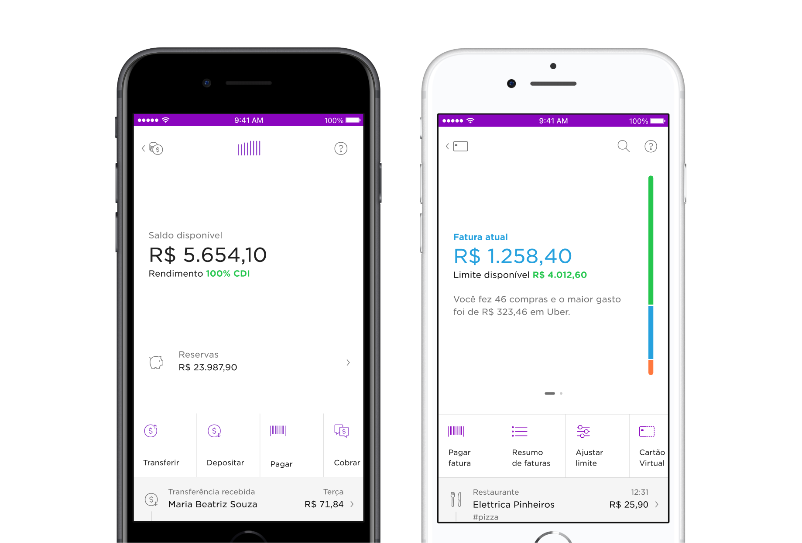
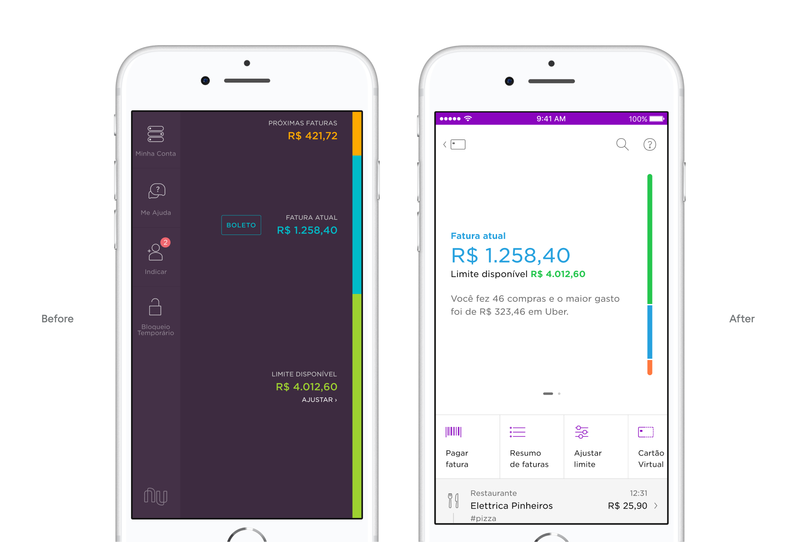
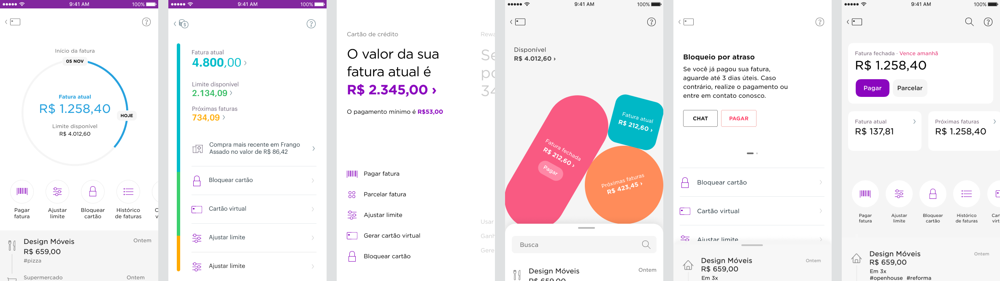
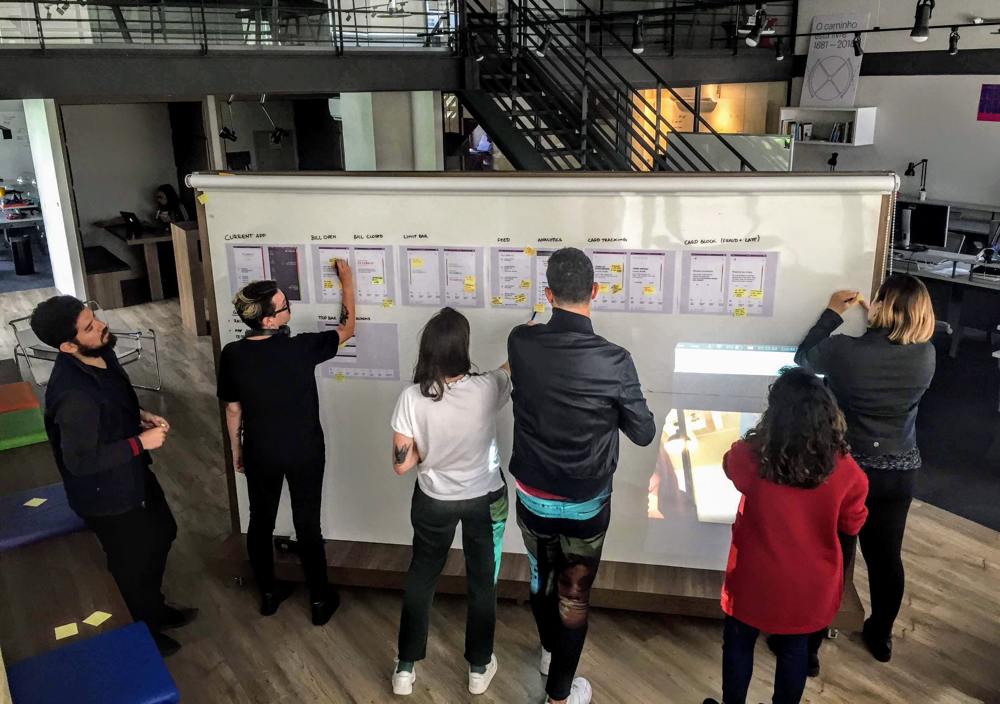
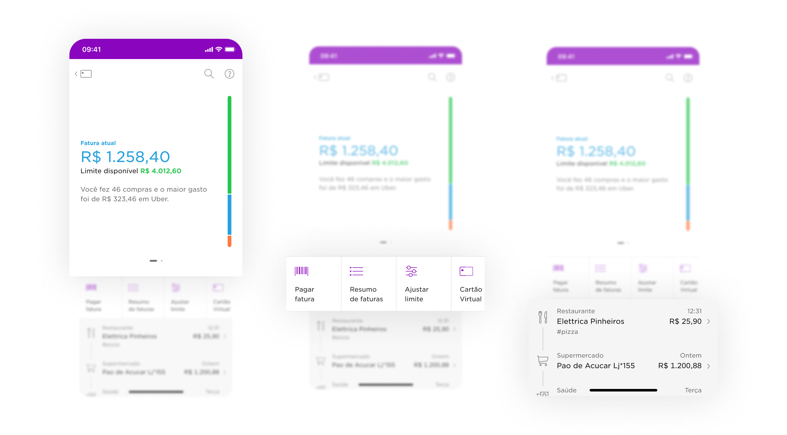
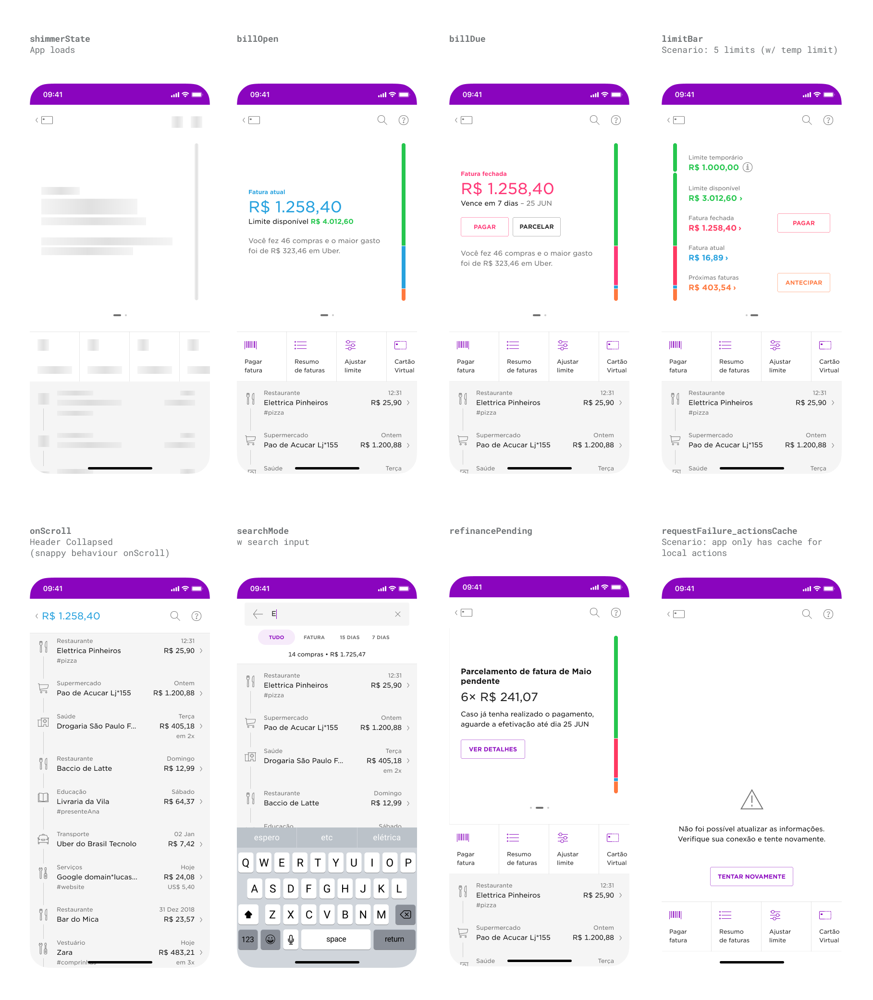
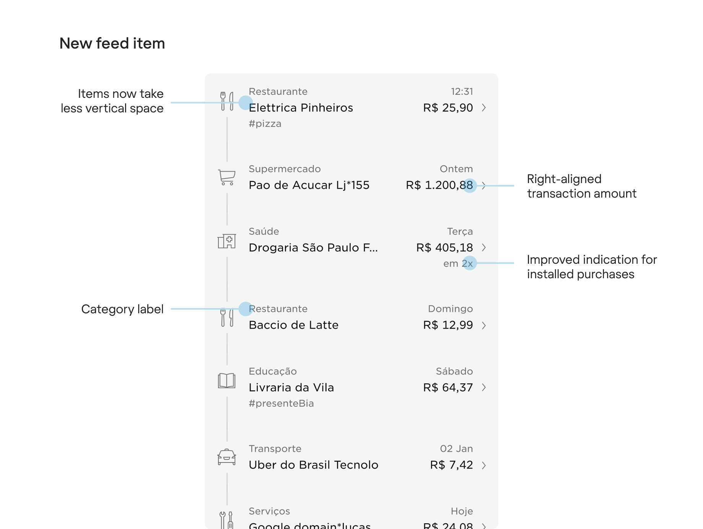
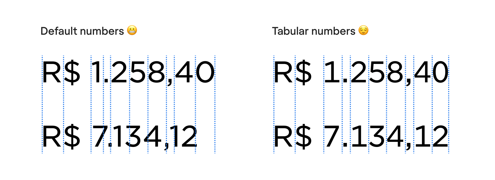
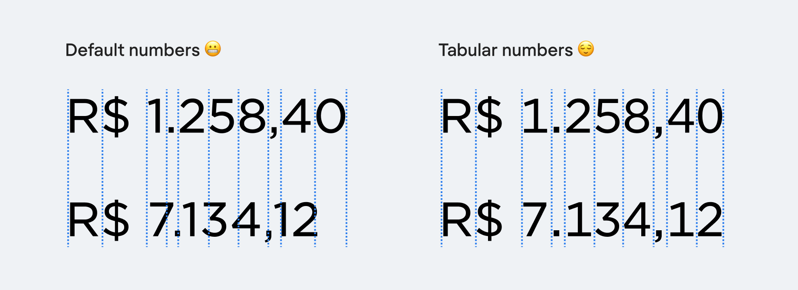
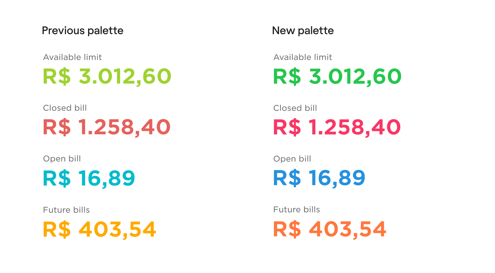

<!-- 

 -->

<!--  -->

### Overview
As Nubank shifted from a credit card company to a more robust banking ecosystem, it became evident the need for a more cohesive interface for our products.

Different patterns accross the app hindered user onboarding, feature discovery and didn’t optimize for new and important product offerings. The current designs weren’t flexible enough to accomodate new features. Over 3½ months, I redesigned the experience for credit card and partnered with other two designers to revamp the savings account interface.

### Impact

 
	

		<h3 style="margin-top:0"><strong>+6%</strong></h3>
		
people paying their credit card bill on time

	

	

		<h3 style="margin-top:0"><strong>+3%</strong></h3>
		
in revenue from instalment anticipation

	

 
	

		<h3 style="margin-top:0"><strong>+4%</strong></h3>
		
savings in customer support

	

	

		<h3 style="margin-top:0"><strong>2+ years</strong></h3>
		
shipping new features without refactoring the new interface

	

 
 

##### Long-format story below ↓

 

---
 

## Context 
### The Nubank app
A couple of months before I started working on the dashboards the Nubank app got a new home-screen. The new interface opened doors for a multi-product scenario and consisted of two main elements:

1. **Widgets** — cards that worked as windows to the products (savings, credit card and rewards). 
2. **Shortcuts** — buttons that helped navigate from one place to the other. They worked like doors to other parts of the app.

	</img>

<h5 style="margin-top: -24px">New home screen, May 2018</h5>

The new home screen was succesful at giving more visibility for the savings account and rewards program, but also highlighted the inconsistencies in the UI, navigation and gestures.

##### Swiping left in Credit Card, Nuconta and Rewards.  Different results and confused users.

Users needed to learn how to use 3 different interfaces and we were distancing from Nubank’s “fight complexity, empower people” motto. We were onboarding over a million customers per month and our app urged a new product structure for both NuConta and the Credit Card.

 

---

 

####  Part I 
## Rebuilding Credit Card

### My role
I wore a Product Designer and Product Manager hat in this project. I was responsible for pitching it's importance, getting a team staffed, designing the user interface and then guiding prioritisation and stakeholder management.

*Here I'll cover the story of how I got it prioritised it and some of the key design decisions I made*.

### Influencing the product roadmap
The first thing to get this project in our roadmap was to build a strong business case, demonstrating the value a new interface would have on the business.

Since credit-card was the oldest user interface I had a ton of user and peer feedback to start with. Besides reading, clustering and selecting which user problems were the most important to solve, I partnered with a number of engineers and data scientists that helped me understand and list down technical constraints and business opportunities.

</img>

##### I collected the key problems with the current app to get a better understanding of the real opportunity

I grouped all user, tech and business problems the new interface should address and shared it with multiple teams and functions across the company to gather feedback.

### Problems
Here are some of the problems I aimed to solve with the new interface:

| | |
|---|---|
| <h2 style="color:var(--font-high-contrast);margin-bottom:var(--u1);">📲</h2>*Confusing navigation and unintuitive gestures*   There were no visual cues for swiping to reveal more information about your credit card (i.e. limit utilization). In fact, less than 48% of customers had ever swiped in this screen. | <h2 style="color:var(--font-high-contrast);margin-bottom:var(--u1);">🌱</h2> *No room for the product to continue to grow*   The lack of real state was making it more and more difficult to ship new features — and for customers to find them. |
| <h2 style="color:var(--font-high-contrast);margin-bottom:var(--u1);">🌈</h2>*Colours and accessibility*   Previous palette worked on a dark purple background but was too bright against the white we were adopting across the app. | <h2 style="color:var(--font-high-contrast);margin-bottom:var(--u1)">🧑‍🏭</h2>*Operation scalability*   Roughly 30% of customer support tickets had to do with options available for self-servicing in the app. This was a clear blocker to our scalability goals. |
| <h2 style="color:var(--font-high-contrast);margin-bottom:var(--u1)">🧪</h2>*Experimenting in the app was painful*   There were thousands of lines of unmaintained native code and every minor tweak required a new release to the app stores, slowing down teams from learning about customers. | <h2 style="color:var(--font-high-contrast);margin-bottom:var(--u1);">🇧🇷🇲🇽🇨🇴</h2> *Nubank was about to start international expansion*   In a few months, credit card would be the first product launched in new markets out of Brazil (Mexico and Colombia). |

 

><h5 style="margin-bottom:1rem">Goal</h5>
><h3 style="margin-top:1rem; text-align: center;max-width: 400px"> Recover the magic and ease of use of the credit card app</h3>
><h5>and optimise it for more product experimentation</h5>

### Considering design directions
After setting design principles for the new design I started exploring broad directions that could address the problems and opportunities identified.

I ran weekly Design Critiques with the Mexico and Brazil teams, bringing voices from Engineering, Product, Data Science and Product/Brand Designers to refine the new interface.

<h5> One of many critique sessions Early on I prefer paper, sticky notes, thick pens and pointing over pixels on a screen 🙃</h5>

Rounds of critiques and working with other two colleagues on the savings account pointed that the alternative that seemed to scale best across products was a vertical stacking of:
- *Hero* — where we display the most important/contextual information about the product
- *Shortcuts swiper* — Actions and navigation to the contextual environment
- *Events feed* - List of transactions and changes regarding the given product.

Here's how this structure translated in the final design for Credit Card:

 

## Design details

### ❶ Straightforward navigation and faster decision making
It's no secret dealing with financial services can be overwhelming — or even daunting. Information should be easy for customers to discover, understand and feel confident about making a decision. 

The new hero is more prominent than it used to be, highlighting the most important and contextual information like current bill states, limit information or action required states.

Pagination indicates there's more on the swipe, preserving the gesture for old users. Checking limit bar details. *Over 76% of new customers check their limit utilization within the first week with the product — as opposed to the previous 48%*.

#### Launch video &#x2935;
`video: ./images/cc-redesign.mp4`
<h5>Key changes of the new design. Video by Everton Guilherme.  Unmute video for full experience</h5>

More pages can be added (as long as they follow a set of defined rules) and *all content (text, illustrations, icons, buttons) can be customized via backend* (valuable for experimentation and international expansion). 

 

### ❷ Improving feature discoverability
#### Enhancements to feed items
Using better patterns in the feed to afford tappability went a long way in educating customers about the an extra level of information about the transaction. The number of disputes opened via the self-serviced app increased 4 percentual points (p.p) while reducing by 3p.p the contacts via phone/email.

Besides adding a chevron `›` to convey tappable feed items, I also solved a couple other legibility issues. The first of them, was to align amounts to the right — so customers can browse items either by scanning merchant names or transaction amount.

I also opted for tabular numbers so they would align vertically. Here's the difference:

 

#### Actions and navigation at the center of the stage
Bringing actions from the purple screen to the action swiper also increased in 11p.p the number of customers that now check past bill statements.

<!--  -->

<!--  -->

  

### ❸ Better colour contrast and revised accessibility

Colors are used to comunicate limit utilization and bill states. The previous palette worked well on the dark purple background but as the app shifted towards a white background, the green, blue and orange had poor contrast on white.

In addition, I also dedicated a ton of attention to the tags, hints and traits to ensure visually impaired customers had the same quality.

<!-- 
### Problem #5: Customization & Experimentation
This is not exactly a user problem, but rather a mix of a product, tech and design opportunity, that I wanted to highlight here. 

One of the pains product managers and designers felt the most was that every small change they wanted to bring to the UI required a new release in the app stores. This was slowing down experimentation and customization at a time we needed them the most. I pushed hard for making this UI controlled from the server side — which later became a huge catalyst for product experimentation at Nubank.

By the time of writing this, in early 2020 we're still using this custom markdown language to control content and styling. 

### Personal notes and learnings

| | |
|---|---|
| <h2 style="color:var(--font-high-contrast);margin-bottom:var(--u1);">📲</h2>*Product Design*   In most companies Product Design deals with screen design and have little influence on the product. This project is a solid example of the kind of designer I enjoy being. I like to build products and articulate user/organization needs beyond the design itself | <h2 style="color:var(--font-high-contrast);margin-bottom:var(--u1);">🌱</h2> *Product*   While there are many parts of the PM job that I love doing — and have considered a career switch at some stage — I much rather be a "PM-y Designer" rather than a "Design-y PM".
 |
| <h2 style="color:var(--font-high-contrast);margin-bottom:var(--u1);">🌈</h2>*Colours and accessibility*   Previous palette worked on a dark purple background but was too bright against the white we were adopting across the app. | <h2 style="color:var(--font-high-contrast);margin-bottom:var(--u1)">🧑‍🏭</h2>*Operation scalability*   Roughly 30% of customer support tickets had to do with options available for self-servicing in the app. This was a clear blocker to our scalability goals. |
| <h2 style="color:var(--font-high-contrast);margin-bottom:var(--u1)">🧪</h2>*Experimenting in the app was painful*   There were thousands of lines of unmaintained native code and every minor tweak required a new release to the app stores, slowing down teams from learning about customers. | <h2 style="color:var(--font-high-contrast);margin-bottom:var(--u1);">🇧🇷🇲🇽🇨🇴</h2> *Nubank was about to start international expansion*   In a few months, credit card would be the first product launched in new markets out of Brazil (Mexico and Colombia). |
3. There were many moving pieces (especially organizational and technology changes) happening at the same time. These were a great opportunity to exercise soft skills as well as hard-design-skills and made me a much better designer when I got to the other side
4. Pairing with engineers as they were learning Flutter was a lot of fun. It taught me a lot about their approach towards learning from existing sources as well as from one another.
5. Finding an opportunity no-one sees, understanding how valuable it can be and delivering with quality is ultra valuable as you progress in your career and builds your track of record/trust with your peers. Up until today this is something I want every designer on the team to know they can do and I am here to help them achieve it.

-->

---

#### Part II
## Revamping the savings account – NuConta

### Context
I started working on the evolution of the savings account (NuConta) interface around 6 months after it's launch, along with other two designers.

At that time, Mateus P. and I were working on the yet-to-be-released personal loans product while Lucas N. was exploring ways to help customers separate money. After a few rounds of user interviews, it was clear: *our features would struggle to coexist in NuConta's main screen. *NuConta's 6 months old interface was already bloated.

 

><h5 style="margin-bottom:1rem">Project Goal</h5>
><h3 style="margin-top:1rem; text-align: center"> Open the way for NuConta's growth.</h3>

### Challenges
Some of the questions and challenges faced:

1. #### Do people understand the graph?
The original UI was ~50% a bar chart. When launching the product the team didn’t spend much time evaluating if people understood/ saw value in it. 

2. #### People's mental model was different from how the product works
Our mix of a checking + savings account generated a lot of buzz but that wasn't enough. Customers wanted to separate their money in two different categories: `to spend` and `to save`.

3. #### Unintuitive gestures
Searching for the term "NuConta" returned <a href="https://www.techtudo.com.br/dicas-e-tutoriais/2018/04/como-encontrar-comprovantes-de-transferencias-da-nuconta.ghtml" target="blank" style="cursor: url('./images/card.png')">multiple tutorials</a> on how to access the list of transactions and other essencial features for customers.

4. #### Upcoming feature boom
The product was a skeleton of a bank account — with no debit card; ATM withdrawal; auto-debit and other basic features. The number of features would grow increasingly fast and we needed to improve visibility of new product offerings.

### Explorations
Having defined the main goals, I spent several afternoons pairing with my colleagues in the Design Studio. For every new concept I also explored how it would be translated to the Credit Card interface – and then, brought back a new idea that could be used for the savings account too.

<table style="max-width: var(--body-width)">
  <tbody>
    <th>
    </th>
    <tr style="vertical-align:top;">
      <td>
	  	<h3 style="">An unusual quantitative approach</h3>
		
Prototypes evolved into completely removing the graph from the interface. Before making a final call, our UX researcher suggested collecting quantitative impressions.

		
We used Instagram Stories' recently launched poll sticker to quickly grasp how people perceived the graph.

      </td>
      <td style="">
        </img>
      </td>
    </tr>
  </tbody>
</table>

### Informed by data, not driven by it
While most respondants said they found the graph helpful, that was never translated in people's stories with the product. We decided to move with a much smaller version of the graph. Giving more emphasis to the numbers went a long way helping customers understand what was going on with their money at a glance.

### New design highlights
Here are some of the key decisions made over six weeks of work. 

|                            |            |
| ------------------------------------| ---------- |
|<h4>Mini-graph</h4> People used the graph mostly to understand trends about their money. On tap it now opens a more detailed analytics screen. | <h4>Supporting multiple actions</h4> There was a number of actions being launched for the product. The new pattern now aligns icon and text to the left when there are 4+ options and turns into a swiper ribbon. |

|                                     |            |
| ------------------------------------| ---------- |
| <h4>Transaction list</h4> Transactions are now displayed in a much more natural vertical scroll. |   <h4>More space for the new features</h4> This is as busy as the UI gets if you have a e. Money to spend, to save and loans to pay all at a glance. |
