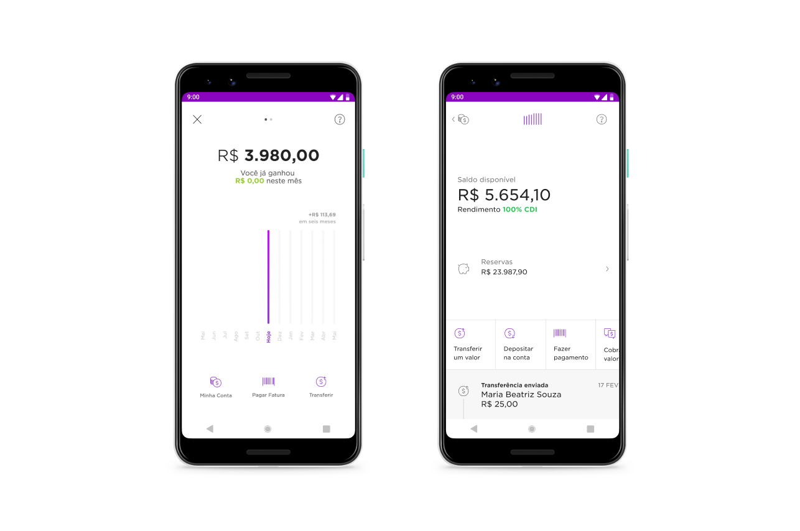
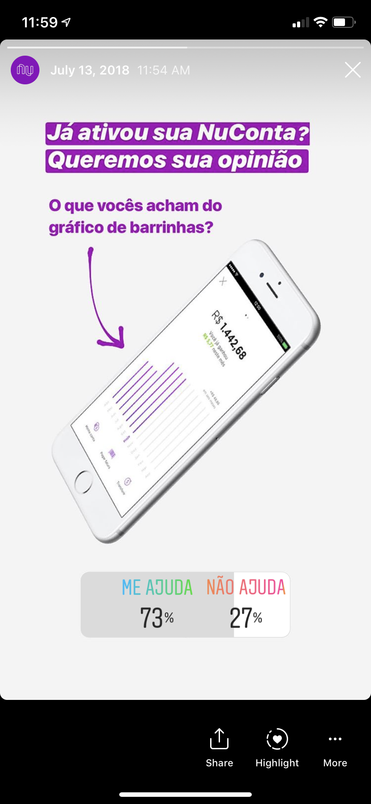
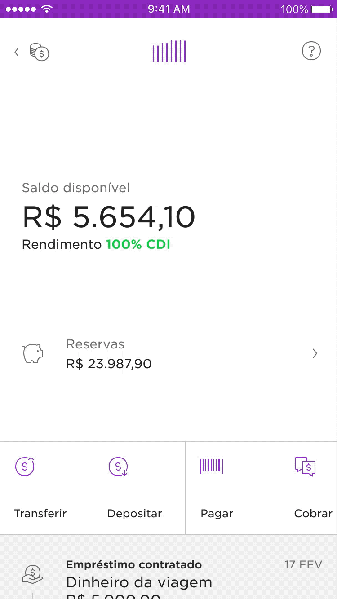

<!-- 

 -->

`video: ./images/cc-redesign.mp4`

##### Video by Everton Guilherme

### Overview
As Nubank shifted from a credit card to a more robust banking ecosystem, it became evident the need for a more cohesive interface for our products.

Different patterns accross the app hindered user onboarding, feature discovery and didn’t optimize for important product offerings. The current designs weren’t flexible enough to accomodate new features.

These two projects combined took the course of 3½ months where I redesigned and prototyped a new experience for our savings account and credit card dashboards.

### Impact

 
	

		<h3 style="margin-top:0"><strong>+6%</strong></h3>
		
people paying their credit card bill on time

	

	

		<h3 style="margin-top:0"><strong>+3%</strong></h3>
		
in revenue from instalment anticipation

	

 
	

		<h3 style="margin-top:0"><strong>+4%</strong></h3>
		
savings in customer support

	

	

		<h3 style="margin-top:0"><strong>2+ years</strong></h3>
		
shipping new features without refactoring the new interface

	

 
 

##### Long-format story below ↓

 

---

	</img>

<h5 style="margin-top: -24px">Nubank new home screen, May 2018</h5>

### Context: the Nubank app
In 2018, four years after Nubank was first launched to the public, we released the first redesign of our app's home screen. Six months before Nubank had been a credit card (only) company. 

Now, as we rolled out NuConta – a unique mix of savings and checking account – the app needed the space and structure for our family of products to continue to grow.

This design, led by Guilherme Neumann, was the shell for Nubank’s products and consisted of two main components.

1. **Widgets** — cards that worked as windows to the products (conta, credit and rewards). 
2. **Shortcuts** — buttons that helped navigate from one place to the other. They worked like doors to other parts of the app.  

Once you opened each of the widgets this is what you would see:

 
##### Product dashboards before the revamp.   While some of the structure was shared, you could see the fingerprints.

### The need for a new design framework
While the new home screen was succesful at giving more visibility of the savings account and rewards programme, it also highlighted the inconsistencies in the UI.

People had a steeper learning curve before making their first deposit and activating their credit card. We were distancing from Nubank’s “fight complexity, empower people” motto.

Here’s an example:

##### Swiping left in Credit Card, Nuconta and Rewards.  Different results and confused users.

As we onboarded several thousand — and later over a million — customers per month, our app urged a new product structure for both NuConta and the Credit Card.

 

---

 

####  Part I 
## Revamping the savings account – NuConta

Not long after rolling out our mix of checking/savings account I started working on the evolution of the original interface along with other two designers.

At that time, Mateus Peixoto and I were working on the yet-to-be-released personal loans product while Lucas Neumann was exploring ways to help customers separate money. After a few rounds of user interviews in our projects, it was clear: *our features would struggle to coexist in NuConta's main screen.*NuConta's 6 months old interface was already bloated.

 

><h5 style="margin-bottom:1rem">Project Goal</h5>
><h3 style="margin-top:1rem; text-align: center"> Open the way for NuConta's growth.</h3>

Some of the questions and challenges faced:

1. #### Do people understand the graph?
The original UI was ~50% a bar chart. When launching the product the team didn’t spend much time evaluating if people understood/ saw value in it. 

2. #### People's mental model was different from how the product works
Our mix of a checking + savings account generated a lot of buzz but that wasn't enough. Customers wanted to separate their money in two different categories: `to spend` and `to save`.

3. #### Unintuitive gestures
Searching for the term "NuConta" returned <a href="https://www.techtudo.com.br/dicas-e-tutoriais/2018/04/como-encontrar-comprovantes-de-transferencias-da-nuconta.ghtml" target="blank" style="cursor: url('./images/card.png')">multiple tutorials</a> on how to access the list of transactions and other essencial features for customers.

4. #### Upcoming feature boom
The product was a skeleton of a bank account — with no debit card; ATM withdrawal; auto-debit and other basic features. The number of features would grow increasingly fast and we needed to improve visibility of new product offerings.

### Explorations
Having defined the main goals, I spent several afternoons pairing with my colleagues in the Design Studio. For every new concept I also explored how it would be translated to the Credit Card interface – and then, brought back a new idea that could be used for the savings account too.

<table style="max-width: var(--body-width)">
  <tbody>
    <th>
    </th>
    <tr style="vertical-align:top;">
      <td>
	  	<h3 style="">An unusual quantitative approach</h3>
		
Prototypes evolved into completely removing the graph from the interface. Before making a final call, our UX researcher suggested collecting quantitative impressions.

		
We used Instagram Stories' recently launched poll sticker to quickly grasp how people perceived the graph.

      </td>
      <td style="">
        </img>
      </td>
    </tr>
  </tbody>
</table>

### Informed by data, not driven by it
While most respondants said they found the graph helpful, that was never translated in people's stories with the product. We decided to move with a much smaller version of the graph. Giving more emphasis to the numbers went a long way helping customers understand what was going on with their money at a glance.

### New design highlights
Here are some of the key decisions made over six weeks of work. 

|                            |            |
| ------------------------------------| ---------- |
|<h4>Mini-graph</h4> People used the graph mostly to understand trends about their money. On tap it now opens a more detailed analytics screen. | <h4>Supporting multiple actions</h4> There was a number of actions being launched for the product. The new pattern now aligns icon and text to the left when there are 4+ options and turns into a swiper ribbon. |

|                                     |            |
| ------------------------------------| ---------- |
| <h4>Transaction list</h4> Transactions are now displayed in a much more natural vertical scroll. |   <h4>More space for the new features</h4> This is as busy as the UI gets if you have a e. Money to spend, to save and loans to pay all at a glance. |

 

--- 

 

#### Part II
## Rebuilding Credit Card

Redesigning the Credit Card interface was a whole other adventure. The bulk of the design explorations happened in parallel to the savings account revamp. It was then, also my job to ensure the Credit Card business unit prioritised it and that we had an engineering team working on it.

### My role
I led the design for this project, and later played the role of the Product Manager, leading stakeholder management, helping the team prioritise and slice down our deliveries just right. 

There are many design details I'm proud of but the most impactful decision was making this UI fully controlled from the server side. This project was a catalyst for product experimentation at Nubank.

### Prioritising a redesign
I'm not a believer in redesigns for the sake of "fresh looks" or "increasing consistency throughout the app". Redesigns should have a clear <i>raison d'être</i>. Working backwards from people's (internal and external) needs is how I usually start before trying to measure the potential impact for the business.

##### I collected the key problems people inside and outside the company had to have a better understanding of what was the real opportunity for a redesign

For this project, I began with a Google Doc collecting all the challenges people were facing, from a user, technical, organizational, economics point of view. This document was initially shared with a few key stakeholders and the group . Here are some of them:

#### People
- Shorten users learning curve
- What are these colours on the screen?
- Didn’t know they could pay in advance/ anticipate instalments and get a discount
- Filter search results
- Do I have to wait for my card to arrive? (Virtual card visibility)
- Help me section

#### Technical
- Nubank was sunsetting native development and [embracing Flutter](https://medium.com/building-nubank/https-medium-com-freire-why-nubank-chose-flutter-61b80b568772) to build our app

#### Organizational
- We were already planning our [Mexico operations](https://reut.rs/2vGIBCS), with plans for a subsequent expansion in Latin America. And guess what would be our first product in these new countries?
- There were only half dozen native engineers for a ~200 people org. In-app product development was taking longer as the number of teams expressively grew over the previous year

#### Business
- 

To understand the size of the challenge and collect feedback from other teams/ functions I wrote a document listing all known user, business and tech problems and the requirements for this project. Once mapped, I also added some of the key design decisions and the explanation of how they would help us achieve our business goals.

|                            |            |
| ------------------------------------| ---------- |
|<h4>People problems</h4> 
There was a steep learning curve to understand how our credit card and the UI worked.
<ol><li>I can only see how much is on my closed bill,  what about my open bill expenses?</li><li>Navigation is confusing and requires an unnatural swipe to access actions and other relecant information;</li><li>What are these colors on right side of the screen?</li><li> How do I contact customer support?</li></ol> |<h4>Business & Tech problems</h4>
The product had changed very little in the past couple of years and incremental work was always prioritised over new features.
<ol><li>Contact rate wasn't scaling efficiently as the company continued to grow;</li><li>Our app was a beast even to seasoned mobile engineers. Native development was slowing our learning curve;</li><li>Acquisition movement changed: in the past, the credit card app was that product that introduced NuConta to customers. Now, most customers are approved for an account before we can offer them a credit line.</li> </ol>|

#### Design Problems
When Nubank launched Shell, the main navigation in the credit card app changed. In the pre-Shell design, the first screen when you opened the app would display how you’re using your credit card limit. Swiping right, the interface revealed the credit card transaction history. Swiping left, your bill history.

><h5 style="margin-bottom:1rem">Project Goal</h5>
><h3 style="margin-top:1rem; text-align: center">Recover the magic by putting people in control of their credit card.</h3>

My high level objectives were to:
1. Increase visibility of the credit card limit utilization
2. Give customers more control over their financing and late payment options
3. Open space for experimentation in a 200 people org

### Key information

1. #### Put people on top of their limit utilization.
Increase transparency and visibility of your limit consumption.

=======
### Making sense of an increasing list of constraints
This project began around the time Nubank decided to sunset native development and [embrace Flutter](https://medium.com/building-nubank/https-medium-com-freire-why-nubank-chose-flutter-61b80b568772) to build our app. To make things more interesting, Nubank announced we were [launching in Mexico](https://reut.rs/2vGIBCS) — and guess what our first product there would be ;)

Every week this project gained complexity and a longer list of stakeholders.

To understand the size of the challenge and collect feedback from other teams/ functions I wrote a document listing all known user, business and tech problems and the requirements for this project. Once mapped, I also added some of the key design decisions and the explanation of how they would help us achieve our business goals.

|                            |            |
| ------------------------------------| ---------- |
|<h4>People problems</h4> 
There was a steep learning curve to understand how our credit card and the UI worked.
<ol><li>I can only see how much is on my closed bill,  what about my open bill expenses?</li><li>Navigation is confusing and requires an unnatural swipe to access actions and other relecant information;</li><li>What are these colors on right side of the screen?</li><li> How do I contact customer support?</li></ol> |<h4>Business & Tech problems</h4>
The product had changed very little in the past couple of years and incremental work was always prioritised over new features.
<ol><li>Contact rate wasn't scaling efficiently as the company continued to grow;</li><li>Our app was a beast even to seasoned mobile engineers. Native development was slowing our learning curve;</li><li>Acquisition movement changed: in the past, the credit card app was that product that introduced NuConta to customers. Now, most customers are approved for an account before we can offer them a credit line.</li> </ol>|
>>>>>>> src

|                            |            |
| ------------------------------------| ---------- |
|<h4>People problems</h4> 
There was a steep learning curve to understand how our credit card and the UI worked.
<ol><li>I can only see how much is on my closed bill,  what about my open bill expenses?</li><li>Navigation is confusing and requires an unnatural swipe to access actions and other relecant information;</li><li>What are these colors on right side of the screen?</li><li> How do I contact customer support?</li></ol> |<h4>Business & Tech problems</h4>
The product had changed very little in the past couple of years and incremental work was always prioritised over new features.
<ol><li>Contact rate wasn't scaling efficiently as the company continued to grow;</li><li>Our app was a beast even to seasoned mobile engineers. Native development was slowing our learning curve;</li><li>Acquisition movement changed: in the past, the credit card app was that product that introduced NuConta to customers. Now, most customers are approved for an account before we can offer them a credit line.</li> </ol>|

#### Design Problems
When Nubank launched Shell, the main navigation in the credit card app changed. In the pre-Shell design, the first screen when you opened the app would display how you’re using your credit card limit. Swiping right, the interface revealed the credit card transaction history. Swiping left, your bill history.

<!-- But after the was the initial screen and new customers would only see a bar with colours on the right — with no idea what that meant. -->

<!-- 
The original app showed how you’re allocating your credit card limit, so you could be on top of your finances -->

<!-- 
When opening the credit card widget in the new app, it showed the purchases you made. 
><h5 style="margin-bottom:1rem">Project Goal</h5>
><h3 style="margin-top:1rem; text-align: center">Recover the magic by putting people in control of their credit card.</h3>
My high level objectives were to:
1. Increase visibility of the credit card limit utilization
2. Give customers more control over their financing and late payment options
3. Open space for experimentation in a 200 people org
### Key information
1. #### Put people on top of their limit utilization.
Increase transparency and visibility of your limit consumption.
### Making sense of an increasing list of constraints
This project began around the time Nubank decided to sunset native development and [embrace Flutter](https://medium.com/building-nubank/https-medium-com-freire-why-nubank-chose-flutter-61b80b568772) to build our app. To make things more interesting, Nubank announced we were [launching in Mexico](https://reut.rs/2vGIBCS) — and guess what our first product there would be ;)
Every week this project gained complexity and a longer list of stakeholders.
To understand the size of the challenge and collect feedback from other teams/ functions I wrote a document listing all known user, business and tech problems and the requirements for this project. Once mapped, I also added some of the key design decisions and the explanation of how they would help us achieve our business goals.

|                            |            |
| ------------------------------------| ---------- |
|<h4>People problems</h4> 
There was a steep learning curve to understand how our credit card and the UI worked.
<ol><li>I can only see how much is on my closed bill,  what about my open bill expenses?</li><li>Navigation is confusing and requires an unnatural swipe to access actions and other relecant information;</li><li>What are these colors on right side of the screen?</li><li> How do I contact customer support?</li></ol> |<h4>Business & Tech problems</h4>
The product had changed very little in the past couple of years and incremental work was always prioritised over new features.
<ol><li>Contact rate wasn't scaling efficiently as the company continued to grow;</li><li>Our app was a beast even to seasoned mobile engineers. Native development was slowing our learning curve;</li><li>Acquisition movement changed: in the past, the credit card app was that product that introduced NuConta to customers. Now, most customers are approved for an account before we can offer them a credit line.</li> </ol>|
<!-- But after the was the initial screen and new customers would only see a bar with colours on the right — with no idea what that meant.

<!-- 
The original app showed how you’re allocating your credit card limit, so you could be on top of your finances

<!--

When opening the credit card widget in the new app, it showed the purchases you made. 
<!--
<h5 style="margin-bottom:1rem">Project Goal</h5>
<h3 style="margin-top:1rem; text-align: center">Recover the magic by putting people in control of their credit card.</h3>
<!--
My high level objectives were to:
1. Increase visibility of the credit card limit utilization
2. Give customers more control over their financing and late payment options
3. Open space for experimentation in a 200 people org

<!--
1. #### Put people on top of their limit utilization.
Increase transparency and visibility of your limit consumption.
 In a pre-Nubank world, the credit card limit was a very abstract concept, especially in a country where financing and installments are a HUGE deal. The limit bar (a vertical rectangle showing how much of your limit is dedicated to the open, closed or a future bill) was a game-changer. But now, it was hidden by a gesture customers didn’t know about (~40% of the customers did it). It even generated customer support tickets to understand 
2. #### Clarity about the options they have at hand
Give visibility of important bill states (closed, late, bill payment error, etc) as well as show them the options to pay, refinance, get discounts when anticipating instalments and .
3. #### 
4. #### Raise the bar of accessibility
Nubank's credit card got popular among visually impaired customers because it voice-over worked better than any bank they ever used. This was a minimum requirement for the experience, but we also wanted to improve color contrast and 
### Design exploration
The Credit Card however, had more critical states and over 90% of monthly active users. Every minor change could affect the behaviours and financial health of a 15MM+ user base.
### New design highlights
### Hero
#### Bill States
The most important information about your credit card bill is always at hand.
#### Limit utilization
The limit bar indicated how your credit card limit is compromised. In Brazil, merchants allow customers to pay in instalments without charging interest. Keeping track of multiple financed transactions can be confusing and bringing the limit bar back to the scene helps customers stay in control of their finances.
#### Fun Fact
Number of transactions and the largest expense of that bill.

<!-- But after the was the initial screen and new customers would only see a bar with colours on the right — with no idea what that meant. -->

<!-- 
The original app showed how you’re allocating your credit card limit, so you could be on top of your finances -->

<!-- 
When opening the credit card widget in the new app, it showed the purchases you made.
><h5 style="margin-bottom:1rem">Project Goal</h5>
><h3 style="margin-top:1rem; text-align: center">Recover the magic by putting people in control of their credit card.</h3>
My high level objectives were to:
1. Increase visibility of the credit card limit utilization
2. Give customers more control over their financing and late payment options
3. Open space for experimentation in a 200 people org
### Key information
1. #### Put people on top of their limit utilization.
Increase transparency and visibility of your limit consumption.

<!-- In a pre-Nubank world, the credit card limit was a very abstract concept, especially in a country where financing and installments are a HUGE deal. The limit bar (a vertical rectangle showing how much of your limit is dedicated to the open, closed or a future bill) was a game-changer. But now, it was hidden by a gesture customers didn’t know about (~40% of the customers did it). It even generated customer support tickets to understand
2. #### Clarity about the options they have at hand
Give visibility of important bill states (closed, late, bill payment error, etc) as well as show them the options to pay, refinance, get discounts when anticipating instalments and .
3. #### 
4. #### Raise the bar of accessibility
Nubank's credit card got popular among visually impaired customers because it voice-over worked better than any bank they ever used. This was a minimum requirement for the experience, but we also wanted to improve color contrast and 
### Design exploration
The Credit Card however, had more critical states and over 90% of monthly active users. Every minor change could affect the behaviours and financial health of a 15MM+ user base.

Bringing our new members from Mexico

### Transaction History

Bringing our new members from Mexico

=======
### New design highlights
### Hero
#### Bill States
The most important information about your credit card bill is always at hand.
#### Limit utilization
The limit bar indicated how your credit card limit is compromised. In Brazil, merchants allow customers to pay in instalments without charging interest. Keeping track of multiple financed transactions can be confusing and bringing the limit bar back to the scene helps customers stay in control of their finances.
#### Fun Fact
Number of transactions and the largest expense of that bill.

Bringing our new members from Mexico

### New design highlights
### Hero
#### Bill States
The most important information about your credit card bill is always at hand.
#### Limit utilization
The limit bar indicated how your credit card limit is compromised. In Brazil, merchants allow customers to pay in instalments without charging interest. Keeping track of multiple financed transactions can be confusing and bringing the limit bar back to the scene helps customers stay in control of their finances.
#### Fun Fact
Number of transactions and the largest expense of that bill.
#### Feed items
Around 30% of our customers had never tapped a transaction. This was an important as there are several purchase level options available in the Transaction Details screen.
Numbers are now aligned to the right so identifying a purchase searching for the amount instead of merchant name was – there are several small businesses in Brazil that show up with the name of the vendor and customers don

##### Tabular numbers bring peace of mind
#### Search -->
 <!-- Also, most merchant names are automatically improved but there are cases where customers can't find the vendor name and scan the list of transactions searching for  -->

<!-- 
| <h3>Hero</h3>            |            |
| ------------------------------------| ---------- |
|  <h4>Bill states</h4> The most important information about your credit card bill is always at hand. | <h4>Limit utilization</h4> The limit bar indicated how your credit card limit is compromised. In Brazil, merchants allow customers to pay in instalments without charging interest. Keeping track of multiple financed transactions can be confusing and bringing the limit bar back to the scene helps customers stay in control of their finances. |
|    <h4>Fun facts</h4> Number of transactions and the largest expense of that bill. | |
### Impact

 
	

		<h2><strong>20✕</strong><h2>
		
conversion

	

	

		<h2><strong>20✕</strong><h2>
		
conversion

	

	

		<h2><strong>20✕</strong><h2>
		
conversion

	

|   <h3>Transaction history</h3>                                   |            |
| ------------------------------------| ---------- |
|   <h4>Feed items</h4> Around 30% of our customers had never tapped a transaction. This was an important as there are several purchase level options available in the Transaction Details screen.     Numbers are now aligned to the right so identifying a purchase searching for the amount instead of merchant name was – there are several small businesses in Brazil that show up with the name of the vendor and customers don | <h4>Search</h4> The actions are now in a swiper ribbon similar to the one in Shell. Up to three actions, icon and text are aligned to the center. Beyond that, you can scroll horizontally and icons are aligned to the left for visual hinting |

### Kickass image of conta and CC
#### Search
 <!-- Also, most merchant names are automatically improved but there are cases where customers can't find the vendor name and scan the list of transactions searching for  -->

<!-- 
| <h3>Hero</h3>            |            |
| ------------------------------------| ---------- |
|  <h4>Bill states</h4> The most important information about your credit card bill is always at hand. | <h4>Limit utilization</h4> The limit bar indicated how your credit card limit is compromised. In Brazil, merchants allow customers to pay in instalments without charging interest. Keeping track of multiple financed transactions can be confusing and bringing the limit bar back to the scene helps customers stay in control of their finances. |
|    <h4>Fun facts</h4> Number of transactions and the largest expense of that bill. | |
|   <h3>Transaction history</h3>                                   |            |
| ------------------------------------| ---------- |
|   <h4>Feed items</h4> Around 30% of our customers had never tapped a transaction. This was an important as there are several purchase level options available in the Transaction Details screen.     Numbers are now aligned to the right so identifying a purchase searching for the amount instead of merchant name was – there are several small businesses in Brazil that show up with the name of the vendor and customers don | <h4>Search</h4> The actions are now in a swiper ribbon similar to the one in Shell. Up to three actions, icon and text are aligned to the center. Beyond that, you can scroll horizontally and icons are aligned to the left for visual hinting |

