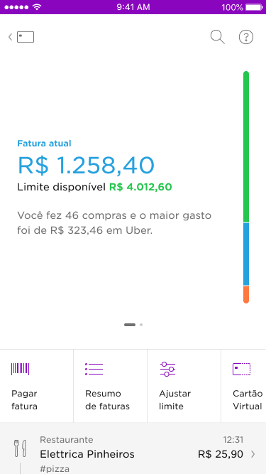

<!-- 

 -->

In 2018, four years after Nubank was first launched to the public, we released the first redesign of our app. Until six months before that we had been a credit card company. Now, as we started rolling out NuConta, a mix of a savings and checking account, we needed space for our family of products to grow. This new design, lead by Guilherme Neumann, was internally called Shell.

Shell had two key elements. Widgets — cards that worked as windows to the products (conta, credit and rewards). And shortcuts — doors that had to navigate from one place to the other, without telling you more than a sign. Once you opened the windows (widgets) this is what you would see in each product.

|  |  |  |
| ---------| ---------- | ----------:|
| | | |

Yes, they felt like totally different apps. However, the main structure was shared.

[   Same img as above, highlighting the same basic structure   ]

This is the story of how we built our product dashboards. While it took a holistic understanding of the products to build a solid foundation that could work for them, the timeline and motivation for each of these projects looked different. Our goal, however, was shared. As we continued to onboard several thousand — and later over a million — customers per month, we needed a product structure that worked for NuConta and Credit Card.

### Part I - NuConta Revamp
#### Context
It wasn’t long after rolling out our mix of checking/savings account for customers that Lucas Neumann, Mateus Peixoto and I started working on the evolution of the original interface. At that time, Lucas N. was looking for ways to help customers separate money in “to spend” and “to save”, while Mateus and I were working on our yet-to-be-released personal loans product. After a few rounds of user interviews in each of our projects, we realized our features would have a hard time coexisting in the available real estate. We needed to open space for the product to grow.

####My role
Product designer, contributing to the product design, prototyping and some of the usability testing. 

####Goal
Redesign our recently launched app in a way that could support the upcoming product expansion.

Some of the challenges we faced were:

|   |   |
|---|---|
| The current interface has a graph that received a lot of emphasis. When launching the product we didn’t spend much time evaluating if people understood/saw value in it.| People were still used to having a checking and a savings account separately. They wanted to separate their money in two different categories: “to spend” and “to save”|
| People rarely access the list of transactions screen. It requires a horizontal swipe to be revealed — and the page indicator is currently placed on the top.|The product was a skeleton of a real bank account — with no debit card; ATM withdrawal; auto-debit and other basic features yet available. We knew it was about to explode and needed to give customers visibility of important offerings, while being sensitive on how we do it. The two we had in our hands were good examples:
Buckets: user engagement, retention
Personal loans: revenue|

#### Explorations
Having the main goals defined, we spent several afternoons pair designing in the Design Studio. Our design files were packed with explorations that reflected our intent to reach the goals mentioned above. Here are some of the explorations and Framer prototypes we did at that time. 

[   Prototypes   ]

#### De-risking product launch
As we brought in customers to interact with our prototypes, our work evolved into completely removing the graph from the interface. Before making the final decision, we had input for our UX researcher Caio Gama suggesting we had more quantitative data before making our call. Instagram stories had then just released a poll feature, which came in hand to quickly get a quantitative understanding of what people thought about the graph.

[   picture of the instagram post   ]

The final design felt like a typographic experience when compared to the emotional appeal that the graph had, but was also much easier for customers to understand what was going on with their money. Here are some of the key decisions we made over a month of work.

[   New Conta design, states: empty, shell,    ]

|                                     |            |
| ------------------------------------| ---------- |
| | <h3>Title</h3> The graph now a served as the entry point to the NuConta analytics screen on the top-center;|
| The graph now a served as the entry point to the NuConta analytics screen on the top-center;| |
|                                     |            |

|                                     |            |
| ------------------------------------| ---------- |
| <h3>Title</h3> The graph now a served as the entry point to the NuConta analytics screen on the top-center;| <h3>Title</h3> The graph now a served as the entry point to the NuConta analytics screen on the top-center;|
|                                     |            |

[Scroll]
The transaction list moved from the horizontal page to a vertical scroll;

[actions popping up and changing alignment]
The actions are now in a swiper ribbon (similar to the one in Shell). When a screen has up to three actions, it 
The Hero finally offered the real state necessary to both our features to coexist.
[IMG lending + Buckets]

Feature adoption + Late rate for Lending
	Thanks for reading until here. While we have increased interaction with the transaction list and solved other usability issues on this project I can’t share much of this data. If you want to see a more complete design process with metrics that indicate success, please keep reading the story ;)

[  Credit card before and after   ]

###Phase II - Rebuilding Credit Card (2018-2019)
	My role
Led the design of the product.

####Prioritising
Redesigning our Credit Card app was a whole other adventure. As mentioned before, Credit Card used to be our only product, and also the entire Nubank app. The design process happened along with the account revamp. After that, it was also part of my job to make sure we prioritise it in our business unit and then got a team of product + engineering to work on it.

At that time, we had just decided to sunset native development and embrace Flutter to develop our app. To make things more interesting, Nubank had also just announced we were opening in Mexico — and I know you can guess what our first product there would be ;)
 Every week this project seemed to gain complexity and a longer list of stakeholders. To get a better understanding of the size of this challenge and also gather input from other teams/ functions I put together a document listing all known user, business and tech problems —and all the requirements this project should take into consideration. 

[  Google Docs GIF   ]

####People problems
Shorten learning curve
What are these colours?
Didn’t know they could pay in advance/ anticipate instalments and get a discount
Filter search results
Do I have to wait for my card to arrive?
Help me section

####Business problems
Acquisition movement changed;
Product experimentation

####Tech Problems
NuConta was a fresh 6 months old product written in React Native and the original code was written by the same engineering team revamping it. Tackling Credit Card legacy code, created by dozens of people over the course of 5 years was a beast that seemed impossible to prioritise. Our native app could speak more languages than a diplomat and teach you the history of mobile software development.

####Design Problems
When Nubank launched Shell, the main navigation in the credit card app changed. In the pre-Shell design, the first screen when you opened the app would display how you’re using your credit card limit. Swiping right, the interface revealed the credit card transaction history. Swiping left, your bill history. 

The new navigation changed that logic. It placed more weight on the list of transactions made with your credit card than on how you’re using your limit. The original screen, showing But after the was the initial screen and new customers would only see a bar with colours on the right — with no idea what that meant.

[GIF original app opening from icon]
The original app showed how you’re allocating your credit card limit, so you could be on top of your finances
[GIF new app opening from shell]
When opening the credit card widget in the new app, it showed the purchases you made.

This was just one of the design debts the new app generated. Here are some more issues we identified with the design

People don’t know they can swipe on this screen. This generates a two issues:
1. Loose track of their credit card limit utilization. 
In a pre-Nubank world, the credit card limit was a very much abstract concept. The limit bar (a vertical rectangle showing how much of your limit is dedicated to the open, closed or a future bill) was a game-changer — and now hidden by a gesture people didn’t know about (~40% of the customers did it). It even generated customer support tickets to understand
2. Both new and existing features are hindered by the navigation
The key actions you could take with your credit card were also in the purple screen.
Transaction list items didn’t convey as tappable
Customers didn’t know they could see more details of a transaction
Reduce learning curve
In the early days of NuConta, customers had a credit card and started adopting our savings product. As a bank account does not involve risk analysis, NuConta’s growth was exponential and we started to see the opposite movement (people approved first for an account and as we learned from them we would offer them a credit card).
Colours worked well on the purple background but were too bright on white.
People don’t know what the colours are
App experimentation

####Design exploration
Most of this work was done in parallel to the Conta redesign so we could question many of our assumptions and test them at once. 

#Impact
