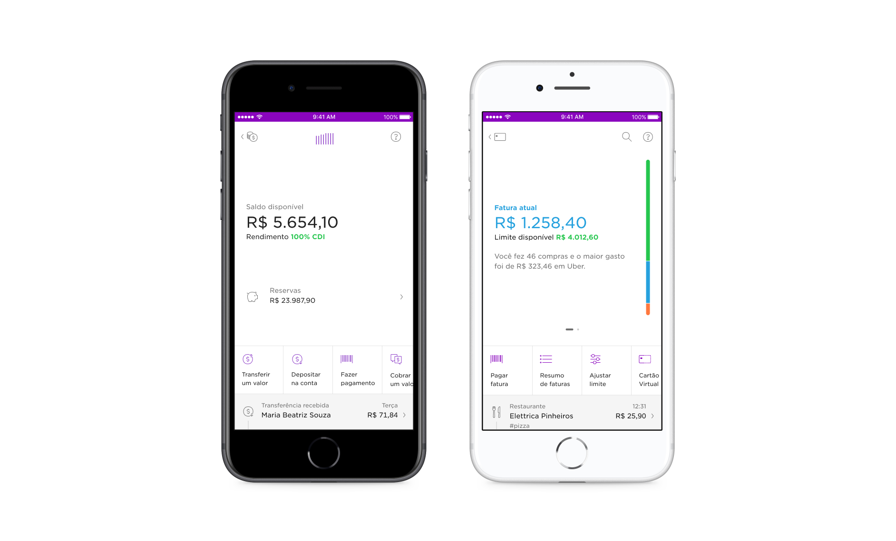
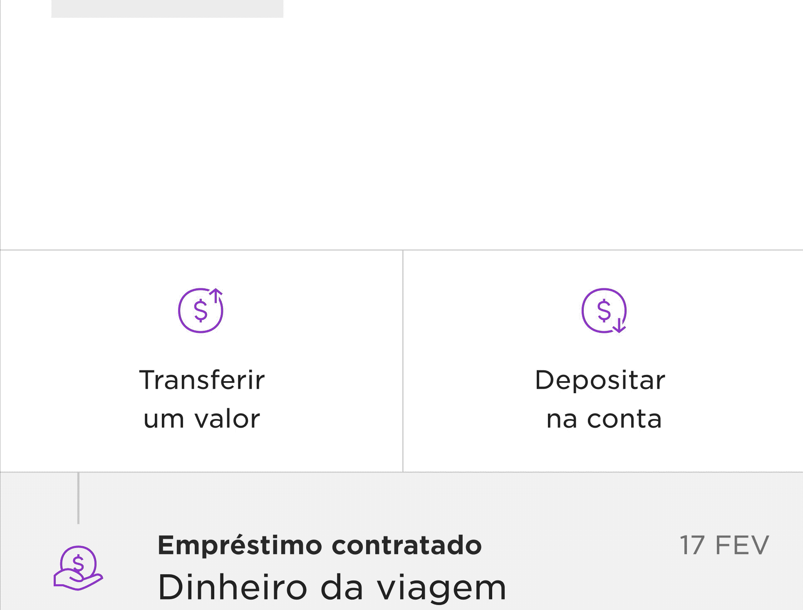
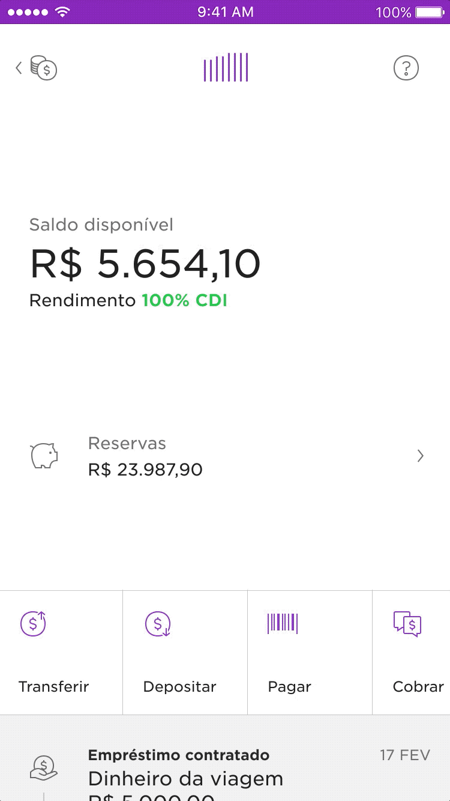

<!-- 

 -->

### Overview
As Nubank went from a credit card to a complete banking solution, it became more evident how we needed a more cohesive interface for each of our products.

Users weren't discovering new features and the business was loosing the opportunity to display new and important product offerings. The design team also knew the current design wasn't flexible enough to accomodate features. 

Over the course of a couple of months, I redesigned and prototyped and a new experience for our savings account and then did the same for Nubank's credit card.

 

	</img>

<h5 style="margin-top: -24px">This is what the new home of our app looked like in May 2018.</h5>

### A brief context about Nubank's app
In 2018, four years after Nubank was first launched to the public, we released the first redesign of our app home screen. Six months before Nubank had been a credit card (only) company. Now, as we rolled out NuConta – a unique mix of savings and checking account – the app needed the space and structure for our family of products to continue to grow.

This is what the home of our app looked like in May 2018.

<!-- `youtube: 0XEUZiRpDIM` -->

This design, led by Guilherme Neumann, worked was the shell for Nubank's products and consisted of two main components.
1. **Widgets** — cards that worked as windows to the products (conta, credit and rewards). 
2. **Shortcuts** — buttons that helped navigate from one place to the other. They worked like doors to other parts of the app.  

Once you opened each of the widgets this is what you would see:

 
##### Product dashboards before the revamp.   While some of the structure was shared, you could see the fingerprints.

### The need for a new design framework
While the new design succeeded at giving more visibility of the savings account and rewards programme, it also highlighted the inconsistencies in the UI. People had a steeper learning curve before making their first deposit and activating their credit card. We were distancing from Nubank's "fight complexity, empower people" motto.

Here's one example of many. Performing the same swipe-left gesture in each of these interfaces would manipulate the content in completely different ways.

##### Swiping left in Credit Card, Nuconta and Rewards had different results and confused users.

As we onboarded several thousand — and later over a million — customers per month, our app urged a new product structure for both NuConta and the Credit Card.

 

---

 

####  Part I 
## Revamping the savings account (NuConta)
It wasn’t long after rolling out our mix of checking/savings account that I started working on the evolution of the original interface along with other two designers.

At that time, Mateus Peixoto and I were working on the yet-to-be-released personal loans product while Lucas Neumann was exploring ways to help customers separate money. After a few rounds of user interviews in our projects, *it became clear that our features would struggle to coexist in NuConta's main screen.* NuConta's 6 months old interface was already bloated.

 

><h5 style="margin-bottom:1rem">Project Goal</h5>
><h3 style="margin-top:1rem; text-align: center"> Redesign the savings interface to support the upcoming product expansion.</h3>

Some of the questions and challenges faced were:

1. #### Do people understand the graph?
The original UI was ~50% a bar chart. When launching the product the team didn’t spend much time evaluating if people understood/ saw value in it. 

2. #### People have a different mental model than the product
The mix of a checking and a savings account didn't seem to match people's expectations. Customers wanted to separate their money in two different categories: “to spend” and “to save”.

3. #### Unintuitive gestures
Searching for the term "NuConta" returned <a href="https://www.techtudo.com.br/dicas-e-tutoriais/2018/04/como-encontrar-comprovantes-de-transferencias-da-nuconta.ghtml" target="blank">multiple tutorials</a> on how to access the list of transactions and other essencial features for customers.

4. #### Upcoming feature boom
The product was a skeleton of a bank account — with no debit card; ATM withdrawal; auto-debit and other basic features. The number of features would grow increasingly fast and we needed to improve visibility of new product offerings.

<!-- <table style="max-width:var(--body-width);">
	<thead>
		<tr>
			<th></th>
			<tbody>
				<tr>
					<td>
						 </img>
						<h4 style="margin-top: 1.5em"> Graph received a lot of emphasis</h4> 
						
When launching the product the team didn’t spend much time evaluating if people understood/ saw value in it.

					</td>
					<td>
						 </img>
						<h4 style="margin-top: 1.5em">People's mental model</h4> 
						
NuConta was a new mix of a checking and a savings account. However, people were used to the conventional model and wanted to separate their money in two different categories: “to spend” and “to save”.

					</td>
				</tr>
				<tr>
					<td>
						 </img>
						<h4 style="margin-top: 1.4em">Unintuitive gestures</h4> 
						
Searching for NuConta online revealed several tutorials on how to access the list of transactions.

					</td>
					<td>
						<h4>Upcoming feature boom</h4> 
						
The product was a skeleton of a bank account — with no debit card; ATM withdrawal; auto-debit and other basic features. The number of features would grow increasingly fast and we needed to improve visibility of new product offerings.

					</td>
				</tr>
			</tbody>
		</th>
	</thead>
</table> -->

### Explorations
Having defined the main goals, I spent several afternoons pair designing with my colleagues in the Design Studio. Our Figma file was packed with literally hundreds of explorations learning about what didn't work and guiding our path towards what did work for users.

For every new exploration, I also explored how that concept would translate to the Credit Card interface — to read more, scroll to Part II.

<table style="max-width: var(--body-width)">
  <tbody>
    <th>
    </th>
    <tr style="vertical-align:top;">
      <td>
	  	<h3 style="">An unusual quantitative approach</h3>
		
Prototypes evolved into completely removing the graph from the interface. Before making a final call, our UX researcher suggested collecting quantitative impressions.

		
We used Instagram Stories' recently launched poll sticker to quickly grasp how people perceived the graph.

      </td>
      <td style="">
        </img>
      </td>
    </tr>
  </tbody>
</table>

### Informed by data, not driven by it
While most respondants said they found the graph helpful, that was never translated in people's stories with the product. We decided to go ahead with a much smaller version of the graph. Giving more emphasis to the numbers goes a long way to help customers understand what was going on with their money at a glance.

### New design highlights
Here are some of the key decisions made over six weeks of work. 

|                                     |            |
| ------------------------------------| ---------- |
| <h3>Mini-graph</h3> The graph now a served as the entry point to the NuConta analytics screen on the top-center  | <h3>Supporting multiple actions</h3> The actions are now in a swiper ribbon similar to the one in Shell. Up to three actions, icon and text are aligned to the center. Beyond that, you can scroll horizontally and icons are aligned to the left for visual hinting |

|                                     |            |
| ------------------------------------| ---------- |
| <h3>Transaction list</h3> Removed the horizontal page to a more natural vertical scroll |   <h3>More space for the new features</h3> This is the busiest the UI would look like for customers now. Money to spend, to save and loans to pay all at a glance.|

<!--  -->

<!-- ### Impact
- Feature adoption + Late rate for Lending
Thanks for reading until here. While we have increased interaction with the transaction list and solved other usability issues on this project I can’t share much of this data. If you want to see a more complete design process with metrics that indicate success, please keep reading the story ;) -->

 

--- 

 

[  Credit card before and after   ]

#### Part II
## Rebuilding Credit Card

### My role
I led the design for this project. There are many design details I'm proud of but the most impactful was to pitch for this project to happen and then ensure the entire UI could be server-side controlled. This project was a catalyst for product experimentation at Nubank.

### Dealing with an increasing list of constraints
Redesigning the Credit Card interface was a whole other adventure. As mentioned before, Credit Card used to be our only product — and also the entire Nubank app. The bulk of the design explorations happened in paralel with the savings account revamp. 

<!-- **After that, it was also part of my job to make sure the Credit Card business unit prioritised it and that we had a team of engineers working on it.** -->

This project began around the time that Nubank decided to **sunset native development and embrace Flutter to build our app**. To make things more interesting, Nubank announced we were launching in Mexico — and guess what our first product there would be ;)

Every week this project gained complexity and a longer list of stakeholders. To get a better understanding of the size of the challenge and collect feedback from other teams/ functions I put together a document listing all known user, business and tech problems —and all the requirements this project should take into consideration. 

<!-- Some of the  -->
#### People problems
- Shorten users learning curve
- What are these colours on the screen?
- Didn’t know they could pay in advance/ anticipate instalments and get a discount
- Filter search results
- Do I have to wait for my card to arrive? (Virtual card visibility)
- Help me section

#### Business problems
- Acquisition movement changed;
- Product experimentation (new language, using markup language to edit)

#### Tech Problems
NuConta was a fresh 6 months old product written in React Native and the original code was written by the same engineers revamping it. Tackling Credit Card legacy code, created by dozens of people over the course of 5 years was a beast that seemed impossible to prioritise. Our native app could speak more languages than a diplomat and teach you the history of mobile software development.

#### Design Problems
When Nubank launched Shell, the main navigation in the credit card app changed. In the pre-Shell design, the first screen when you opened the app would display how you’re using your credit card limit. Swiping right, the interface revealed the credit card transaction history. Swiping left, your bill history.  -->

The new navigation changed that logic. It placed more weight on the list of transactions made with your credit card than on how you’re using your limit. The original screen, showing 

But after the was the initial screen and new customers would only see a bar with colours on the right — with no idea what that meant.

The original app showed how you’re allocating your credit card limit, so you could be on top of your finances

When opening the credit card widget in the new app, it showed the purchases you made.

This was just one of the design debts the new app generated. Here are some more issues we identified with the design

People don’t know they can swipe on this screen. This generates a two issues:

1. ### Loose track of their credit card limit utilization. 
In a pre-Nubank world, the credit card limit was a very abstract concept, especially in a country where financing and installments are a HUGE deal. The limit bar (a vertical rectangle showing how much of your limit is dedicated to the open, closed or a future bill) was a game-changer. But now, it was hidden by a gesture customers didn’t know about (~40% of the customers did it). It even generated customer support tickets to understand
2. ### Both new and existing features are hindered by the navigation
The key actions you could take with your credit card were also in the purple screen.
Transaction list items didn’t convey as tappable
Customers didn’t know they could see more details of a transaction
3. ### Reduce learning curve
In the early days of NuConta, customers had a credit card and started adopting our savings product. As a bank account does not involve risk analysis, NuConta’s growth was exponential and we started to see the opposite movement (people approved first for an account and as we learned from them we would offer them a credit card).
4. ### Accessibility
Colours worked well on the purple background but were too bright on white.
People don’t know what the colours are
App experimentation

### Design exploration
Most of this work was done in parallel to the Conta redesign so we could question many of our assumptions and test them at once. The Credit Card however, had more critical states and a more significant active customer base which helped me to dive deeper in some of the components of the interface.

#### Hero and limit utilization
The credit card app had more complex and critical states than a bank account. I decided to keep the caroussel navigation 

The limit bar indicated how your credit card limit is compromised. Brazil is probably the only country that has 

#### Feed items
Around 30% of our customers had never tapped a transaction. This was an important Also, most merchant names are automatically improved but there are cases where customers can't find the vendor name and scan the list of transactions searching for 

The final adjustment here was to use tabular numbers. Now that we aligned them to the right, this would improve readability as well as 

#### 

### Design

### Impact

 
	

		<h2><strong>20✕</strong><h2>
		
conversion

	

	

		<h2><strong>20✕</strong><h2>
		
conversion

	

	

		<h2><strong>20✕</strong><h2>
		
conversion

	

