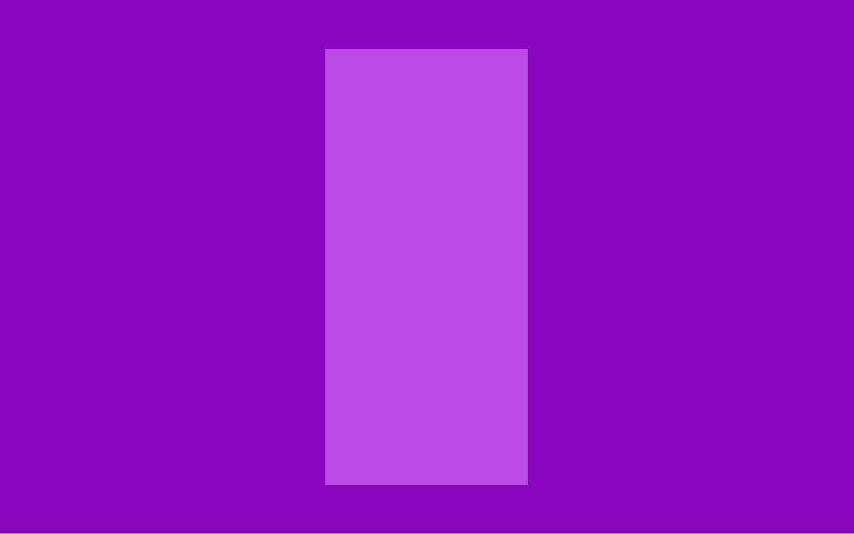

In 2018, four years after Nubank was first launched to the public, we released the first redesign of our app. Until six months before that we had been a credit card company. Now, as we started rolling out NuConta, a mix of a savings and checking account, we needed space for our family of products to grow. This new design, lead by Guilherme Neumann, was internally called Shell.

Shell had two key elements. Widgets — cards that worked as windows to the products (conta, credit and rewards). And shortcuts — doors that had to navigate from one place to the other, without telling you more than a sign. Once you opened the windows (widgets) this is what you would see in each product.

|  |  |  |
| ---------| ---------- | ----------:|
| | | |

Yes, they felt like totally different apps. However, the main structure was shared.

[   Same img as above, highlighting the same basic structure   ]

This is the story of how we built our product dashboards. While it took a holistic understanding of the products to build a solid foundation that could work for them, the timeline and motivation for each of these projects looked different. Our goal, however, was shared. As we continued to onboard several thousand — and later over a million — customers per month, we needed a product structure that worked for NuConta and Credit Card.

[   NuConta before and after   ]

###Part I - NuConta Revamp
It was shortly after rolling out NuConta for customers that Lucas Neumann, Mateus Peixoto and I started working on a new UI for the product. While Lucas N. was looking for ways to help customers separate money in “to spend” and “to save” buckets, Mateus and I were working on our yet-to-be-released personal loans product. The current interface had a graph that received too much emphasis and didn’t seem to leave much space for the new feature/product to coexist with it.

If you’re skimming this article, or just very into lists, here’s some of the things we were trying to solve:

People wanted to separate and manage money in two different groups (tro spend and to save)
Current UI placed a lot of emphasis on the chart. Do people understand/see value in it?
People don’t reach the list of transactions (required a horizontal swipe to reveal it)
We needed to give visibility to important product offerings, while being sensitive on how we do it
Buckets: engagement, retention
Personal loans: revenue

The three of us spent several afternoons pair designing in the Design Studio. Our files were packed with explorations that reflected our intent to reach these 4 goals. Here are some of our explorations and Framer prototypes we did at that time. 

[   Prototypes   ]

Looking for customer feedback before deciding to kill the original graph, our UX Researcher Caio suggested combining the qualitative data with more quantitative data. With the help from our Social Media team, we used Instagram Stories recently released poll feature to understand if people saw value in it.

[   picture of the instagram post   ]

The final design felt like a typographic experience when compared to the original, emotional appeal that the graph had, but it was much easier for customers to understand. The graph now served as the entry point to the NuConta analytics screen; the transaction list moved from the horizontal page to a vertical scroll; the actions moved into a swiper ribbon (similar to the ones in Shell) and the Hero finally offered the real state necessary to 

Some data on the impact we had at NuConta: Blah.

[  Credit card before and after   ]

###Phase II - Rebuilding Credit Card
Redesigning our Credit Card app was a whole other adventure. As you might remember from the beginning of this story, Credit Card used to be our only product — and also the entire Nubank app. When we launched shell, the navigation for the credit card app changed. The first screen when you opened the app used to be the detail of how you’re using your credit card limit. Swiping right, the interface revealed the credit card transaction history. Now, that was the initial screen and new customers would only see a bar with colours on the right — with no idea what that meant.

This was just one of the design debts the new app generated.

While NuConta was a fresh 6 months old product written in React Native and coded by the same engineering team revamping it, Credit Card was bloated with 5 years of poorly maintained code. It could speak more languages than a diplomat and could tell you the history of mobile software development with code in Objective-C, Java, Swift and Kotlin.

In addition, we had just recently announced we were opening our office in Mexico and our first product there would be the credit card. Every week this redesign seemed to gain complexity 

To get a better understanding of the size of the challenge and what we should consider I put together a document with our users, business and tech problems and all the requirements this project should take into consideration.

A real time This was the project I happened some extra few months later and was just as fun but heavily more complex when it came to designing, prioritising it, and later on when we got a team of software engineers working. Let me tell you why and show you 
