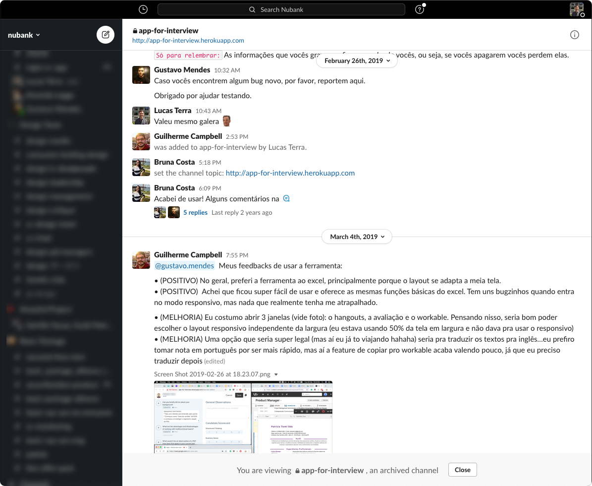
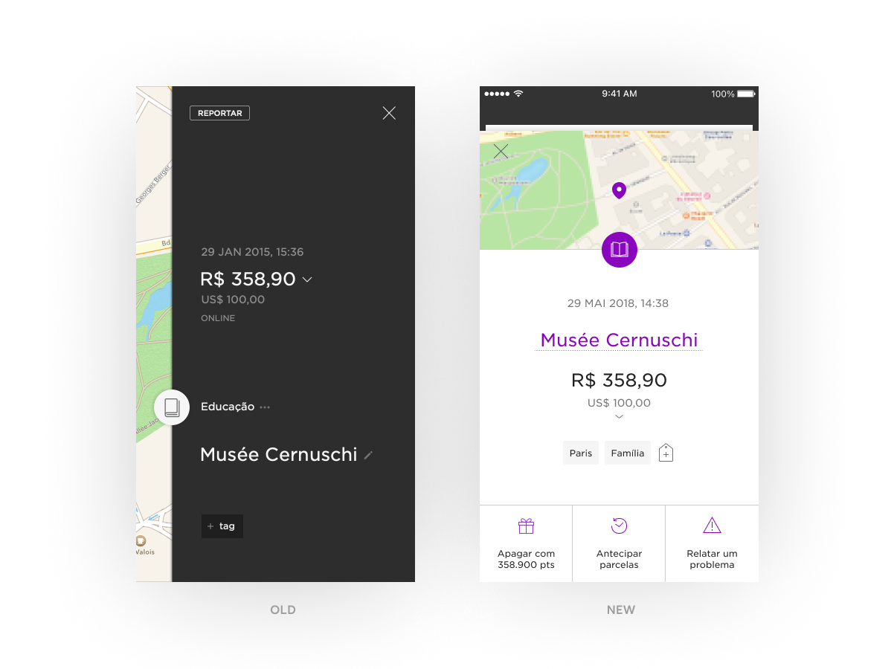
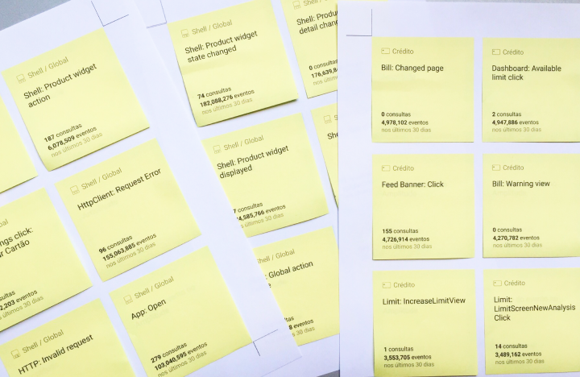

### My relationship with side quests
The thing I love the most about working in the product — rather than consulting, for example — is that it allows me to go beyond well scoped projects and push the future of the company (and the people supporting it) into new and exciting directions.

This is one the things I love the most about my role at Nubank. While many of these self-initiated projects can't be publicly disclosed, here's a small sample of unpretentious work that turned out influencing product strategy, processes or served as housekeeping/ quick-wins.

---

`Coming Soon`

- #### Patent pending project, 2021
Confidential.

- #### Moving money, 2021
Together with a pirate team of four, I have presented a new design and engineering framework for payments — and got approval to staff a new team to work on this opportunity.

- #### Quality principles, 2020
I have listened to different voices at the company to help outline what quality means for Nubank — and how do we keep a high bar for product and engineering.

- #### UX thermometer, 2020
Pushed the company to move away from NPS and embracing more granular ways for measuring product success.

---

### 

<!-- `Previously` -->

<!-- 
### UX Thermometer, 2019
#### Team
Self initiated, with several people included along the way
#### 🤔 Problem
NPS isn't granular nor actionable enough to help teams make product decisions — besides [being considered harmful](). 
#### 🧩 Solution
A modular in-app component that helps teams collect user feedback for specific flows/ features and make better decisions.

--- -->

## App for interview, 2019
 

| 🤔 Problem | 🧩 Solution |
|---|---|
| During Nubank's hypergrowth, it was difficult to keep track of all hiring interviews happening. Recruiting tools didn't optimize for taking and sharing notes on candidates. | A tool that displays the different hiring questions for each position, space to add notes and an easy way to share the scorecard for each candidate.   I designed the tool to work side-by-side to a video call window — and wrote most of the front-end.|

| 🤝 Team | 🕒 Duration |
|---|---|
| Lucas Terra, Gustavo Mendes | Around 8 weeks, with multiple iterations along the way. |

| 🎯 Impact | |
|---|---|
| 75% of the product management team used our tool for phone screening candidates. | |

<!-- || |
|---|---|
|Slack channel we created to collect user feedback across the product org | Event monitoring| -->

---

## Transaction Details, 2018

| 🤔 Problem | 🧩 Solution |
|---|---|
| <ol><li>Customers got in touch with customer support to take actions they already could do via app.</li><li>Visuals were deprecated in comparison to the rest of the app; </li><li>There was a number of non-obvious interactions — such as swiping to reveal the transaction location. </li></ol>| A revamp of the transaction details screen with clearer actions available.     <h4>🎯 Impact</h4>  Reduced in 3,56p.p. the contact rate for some of the biggest customer support queues. |

<!-- gif: exploring ways to open/close
gif: Add tag prototypes
Report button states, new component
duration: 2 weeks -->

---

## Organizing Amplitude Events, 2018

| 🤔 Problem | 🧩 Solution |
|---|---|
| There were too many events being monitored in our analytics. Nubank was spending funds in a sub-optimal way given the number of unused/ deprecated events. | A work session with PMs across the company to map which events were still necessary and trace a plan for data governance at the company. I scraped data on the events from the Amplitude website and printed them in sticky notes to facilitate the session. |

| 🕒 Duration | 🎯 Impact |
|---|---|
| 3 weeks for preparation, host the event and analyse/create a plan with our learnings | Deflected a 40% price increase in the tool subscription — can't reveal figures but think big. This also guided a clearer set of rules and principles for creating using and maintaining data at Nubank. |