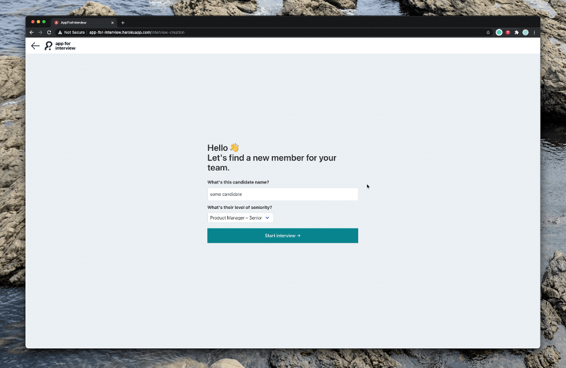
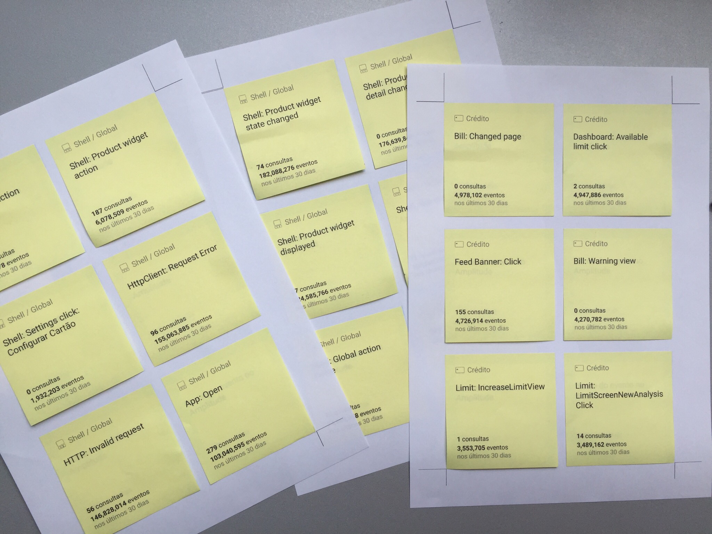

### My relationship with side quests
The thing I love the most about working in the product — rather than consulting, for example — is that it allows me to go beyond well scoped projects and push the future of the company (and the people supporting it) into new and exciting directions.

This is one the things I love the most about my role at Nubank. While many of these self-initiated projects can't be publicly disclosed, here's a small sample of unpretentious work that turned out influencing product strategy, processes or served as housekeeping/ quick-wins.

---

`Coming Soon`

Patent pending project, 2021  
New architecture for moving money, 2021

---

### 

<!-- `Previously` -->

### UX Thermometer, 2019
#### Team
Self initiated, with several people included along the way
#### 🤔 Problem
NPS isn't granular nor actionable enough to help teams make product decisions — besides [being considered harmful](). 
#### 🎯 Solution
A modular in-app component that helps teams collect user feedback for specific flows/ features and make better decisions.

---

### App for interview, 2019
 

| 🤔 Problem | 🎯 Solution |
|---|---|
| During Nubank's hypergrowth, it was difficult to keep track of all hiring interviews happening. Recruiting tools didn't optimize for taking and sharing notes on candidates. | A tool that displays the different hiring questions for each position, space to add notes and an easy way to share the scorecard for each candidate |

| 🤝 Team | 🕒 Duration |
|---|---|
| Lucas Terra, Gustavo Mendes | Around 8 weeks, with multiple iterations along the way. |

---

### Transaction Details, 2018
hero: Before/After

#### 🤔 Problem
Customers didn't report an issue with the merchant or the purchase. Also, the visuals were fully deprecated in comparison to the rest of the app and it was full of hidde interactions (like tapping on the left to reveal the map location of where the transaction happened).
    gif: exploring ways to open/close
    gif: Add tag prototypes
    Report button states, new component
    duration: 2 weeks

#### Solution
Match supply and demand: a fresh transaction details with clearer call to action. 

#### Impact
Reduced in 3,56p.p. the contact rate for chargeback.

---

### Organizing Amplitude Events
 

##### Organizing app events with printable post-its

#### Team
Lucas Terra, Gustavo Mendes
#### 🤔 Problem
There were too many events in Amplitude (the tool we used to instrument our app) and that's the basis for their pricing model. Nubank was spending way over the necessary given the number of unused/ deprecated events.
#### 🎯 Solution
Fostering communication with different teams to know how they were using existing events and what was/wasn't necessary for them. After that, cleaning and defining better rules for instrumenting app events
#### Impact
Saved a 40% price increase in the tool subscription — can't reveal figures but think big ;-)