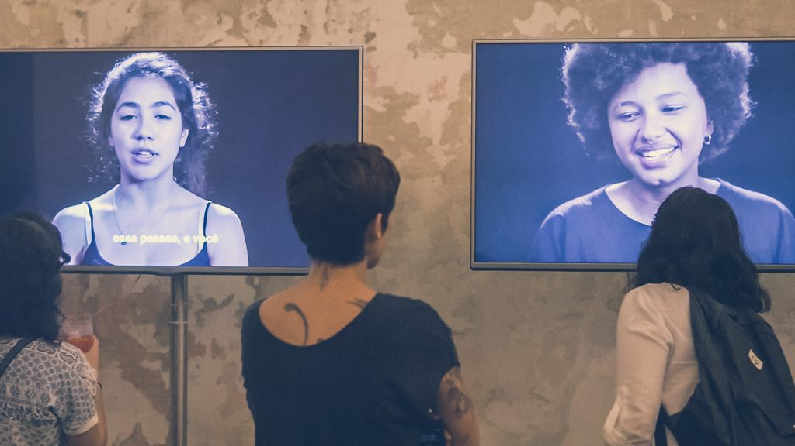

### Context
In 2018 I joined a group of data analysts, programmers, anthropologists, film makers, artists and journalists to discuss the dangers of biased algorithms. The result was a series of videos on to how our biases are embedded in the lines of code shaping our lives.

### The videos
In each video we invited people to go into a conversation with an algorithm. Their goal, was to train an unbiased algorithm on 5 different topics.

Would you be able to program an unbiased machine?

#### Hiring
`video: ./images/bias/bias-hiring.mp4`

#### Love
`video: ./images/bias/bias-love.mp4`

#### Gender
`video: ./images/bias/bias-gender.mp4`

#### Emoji
`video: ./images/bias/bias-emoji.mp4`

#### Lying
`video: ./images/bias/bias-lying.mp4`

### The exhibit
After 6 days working together, we invited the press and general public to watch our creations and ignite the discussion on the topic.

### Making of

`video: ./images/bias/bias-making-of.mp4`

