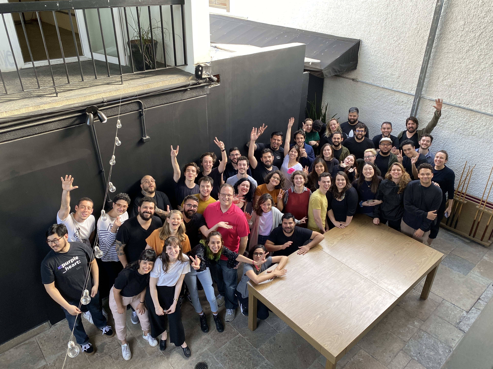

###Type scales
Most styling frameworks today — Gatsby's standard included — have pretty decent type scales. This considering the fact I'm not the type of designer that normally pushes for HUGE fonts but also care about accessibility enough to avoid a 8pt body text. For a project like this, using all styles from `h1` to `h6` plus paragraph seems a bit of an overkill. I won't be using these many styles and think 4 or 5 might be more than enough for now.

|     |       |     |       |
| ----| -----:|
|     |       |

###Type scales
Most styling frameworks today — Gatsby's standard included — have pretty decent type scales. This considering the fact I'm not the type of designer that normally pushes for HUGE fonts but also care about accessibility enough to avoid a 8pt body text. For a project like this, using all styles from `h1` to `h6` plus paragraph seems a bit of an overkill. I won't be using these many styles and think 4 or 5 might be more than enough for now.